<a href="/lisateenused/">Full list in Estonian</a>

**CLEANING AFTER THE PARTY - 25€**
: You don't need to clean or wash anything, we do it all! 

   

**FACE PAINTING - Ursula Otsing - 50 € / 1h**
: Ursula is the best face painter in Estonia! 
In one hour she can do:
-very simple and small drawings ~15 faces per hour
-averages drawings ~8-10 faces per hour
-large and complicated ~5-7 faces per hour

  Glitter tattoos are additionally 45 € per hour and up to 12 children per hour.

  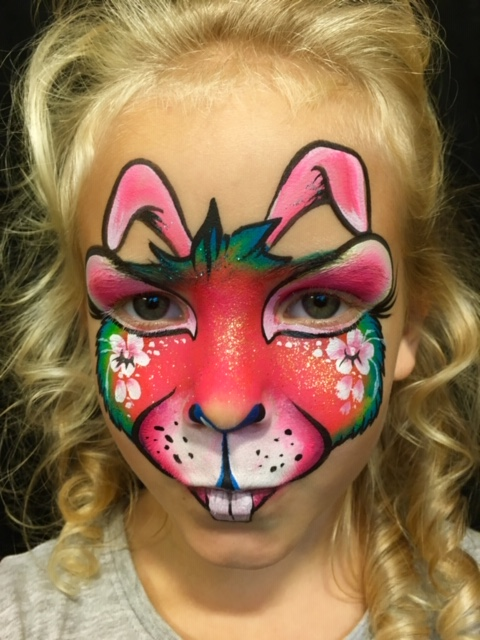 
   

**BALLOON ARTIST - 70 € / 1h**
: Meelika Mäeorg
Meelika makes coolest balloon-animals and even part of her costume is made of balloons!
She can make over 300 different balloon figures with different designs.

   
  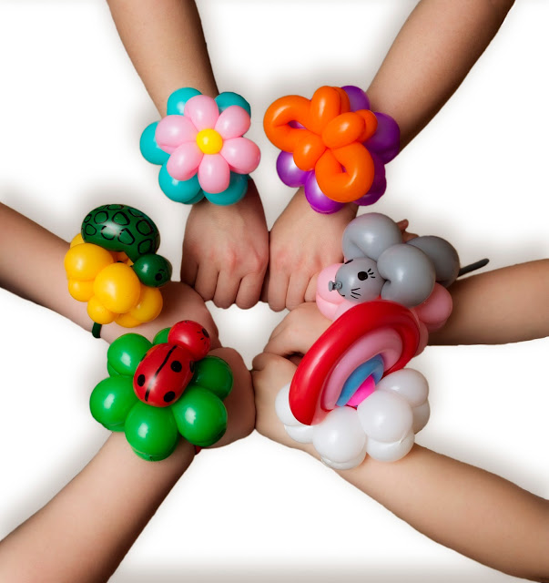 
  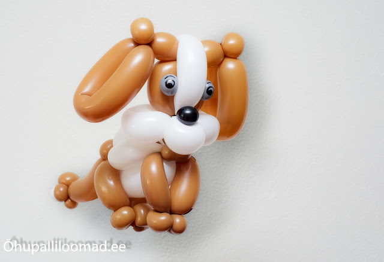 

  In addition to balloon animals, you can also order water tattoos, 1 picture for each child. The price of water tattoos total 20 €. 
  You can choose from 500 different images.

  

**CATERING "KIDS' FAVOURITE - 80 € / 14 kids**
: Yogurt, potato-salad, fruit-vegetables, cheese sticks, popcorn.

**ICE CREAM MACHINE - 59 €**
: You can make your own ice cream! Vanilla and chocolate taste. You can make 40 soft-ice creams. It's possible to buy extra ice cream mixture.

  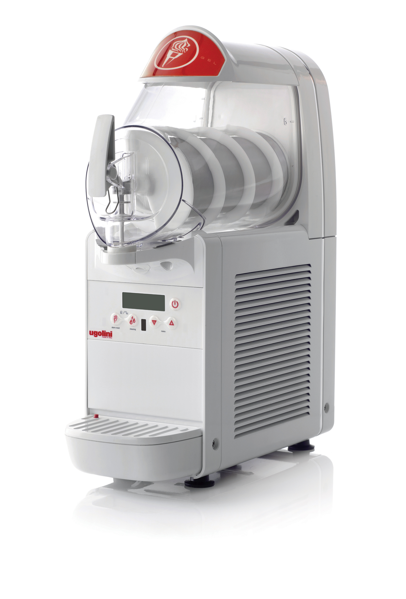

**COTTON CANDY MACHINE - 55 €**
: The real hit of children's birthdays. The cotton candy is ready in 60 seconds, and it's very easy to make. One portion of cotton candy is 12-18 grams of sugar. The price includes: sugar machine, sugar dispenser, 1kg sugar, 50 wooden sticks. It's possible to order also colorful sugars with different flavors.

  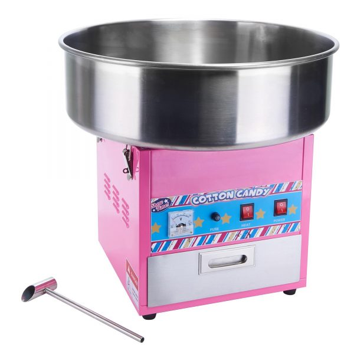

**PHOTOGRAPHER - 135 € / ~2,5h**
: Helen Tulp
https://www.helentulp.com/

  Helen Tulp will capture the true emotions of a child's birthday!

  Helen takes pictures from the beginning of the party until the cake is cut. She makes portraits, family photos and group photos at the photo wall as well as general photos of the event. Photographer makes a digital album with ~200 pictures. Pictures will be completed in a week and access to the album will be sent as a private link where you can download the pictures or share them directly with your friends.

    
   

**VIDEOGRAPHER - 300 € / 3h**
: Marge Prints
http://kuulidmuuvid.ee/

Brighter and more important moments of a child's birthday in high quality video!

Videographer films a party for up to 3h - from the arrival of guests to cutting the cake. The finished video is ~5 minutes long, properly assembled and sounded. 
You get 4K quality video on USB stick with best moments of the birthday party! 
Party guests can watch the movie from the private link on the internet.

  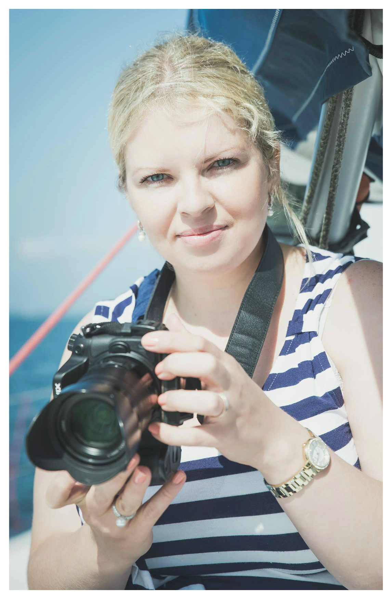

**BUGS PROGRAM - 125 € / 45min**
: Mattias Turovski

The program introduces four different animals, the giant snails, cockroaches, walkingsticks and millipedes. The presentation looks at their images, habitats and introduces ecology. Children can "see and touch" all of them. The program creates preconditions for independent exploration, communication and treatment with invertebrate animals, with respect and care.

Very special and exciting program!

   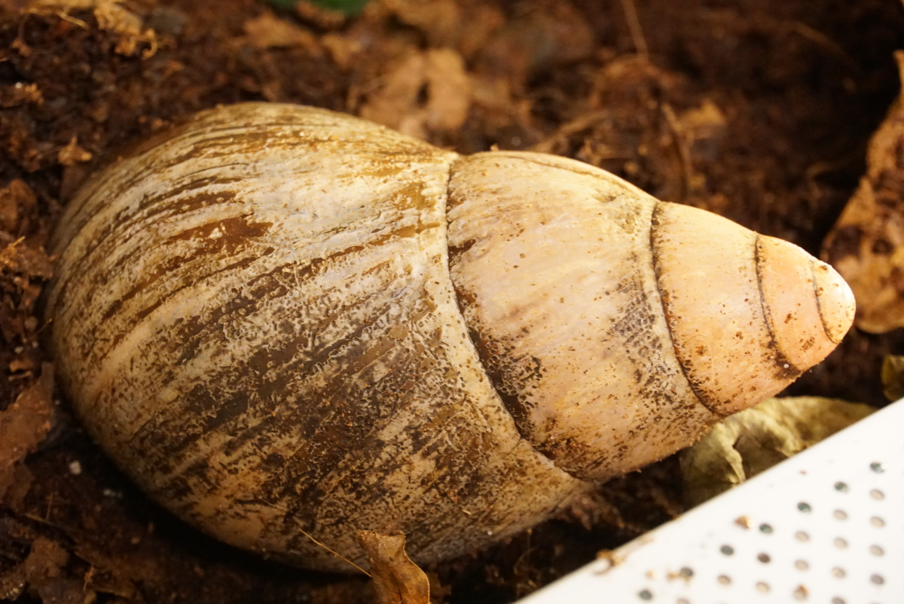 
   
   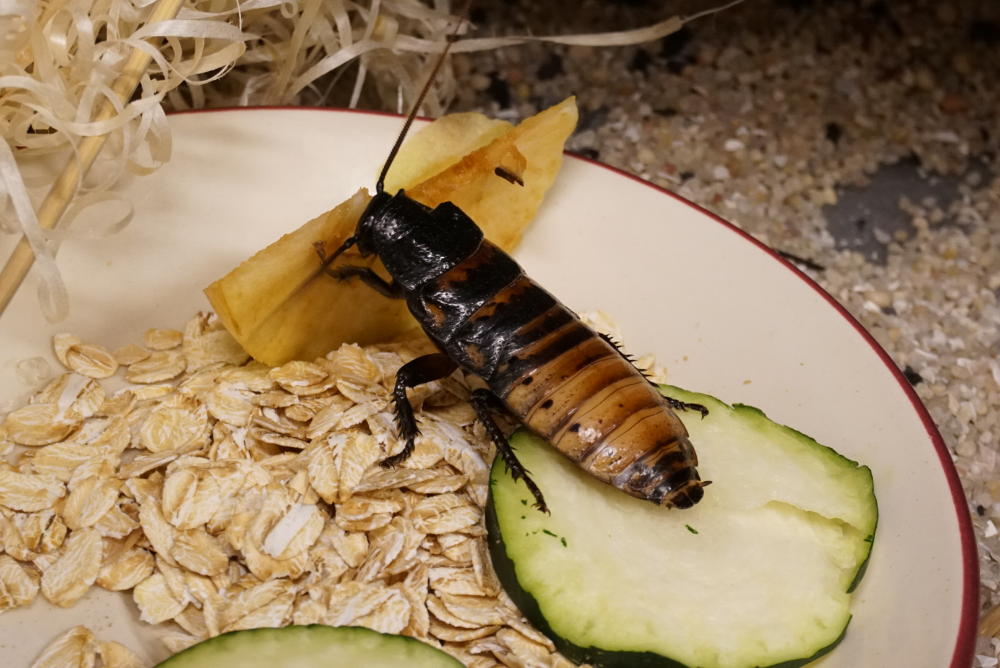
   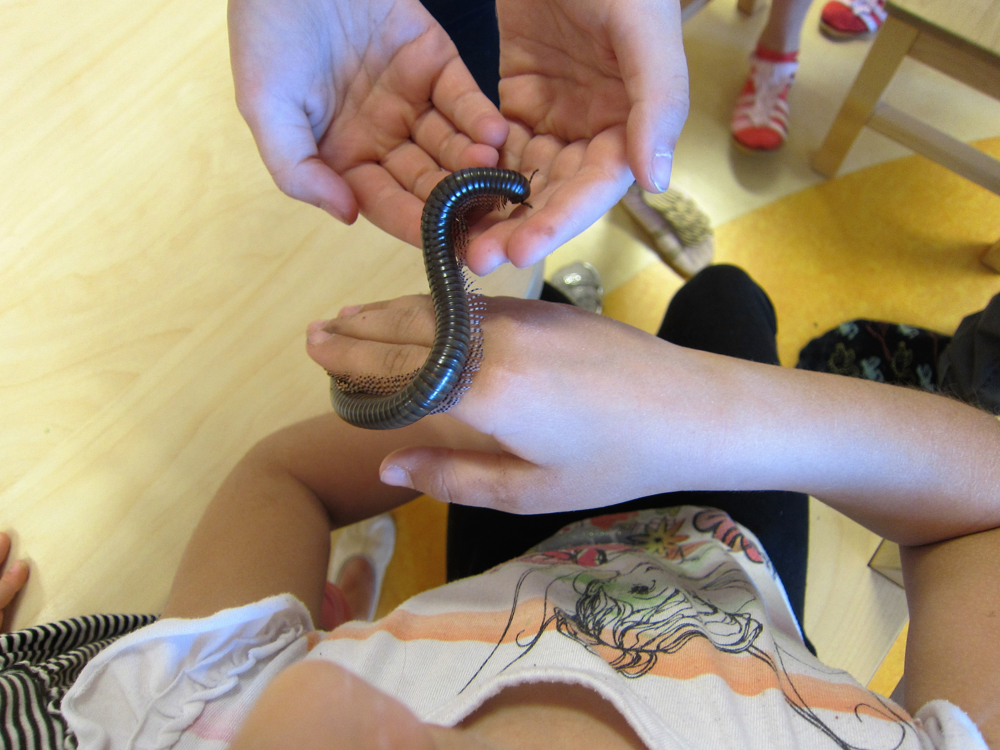

**ANIMATOR / ENTERTAINER - 150€+km / 1-1,5h**
: Merli Rosar 

Animator Merli Rosar from Merros Studio makes evry party unforgettable! There are several costumed characters and programs in the range of 1-1.5h.

Characters: Rapunzel, Pippi Longstocking, Pirate, Native American Indian, Snow White, Lotte, Bunny Juss, Witch Girl, Fairy, Princess, Frozen Anna, Frozen Elsa, Detective, Minnie Mouse, Professor Siiri, Unicorn, Dwarf, Troll Poppy, Vaiana.

More information about the programs: merrosstuudio.ee/programmid/ or merli.rosar@gmail.com.

If you choose an animator when booking a party, we will contact you shortly to clarify everything related to it (availability, price, desired character, etc.).

   
  
  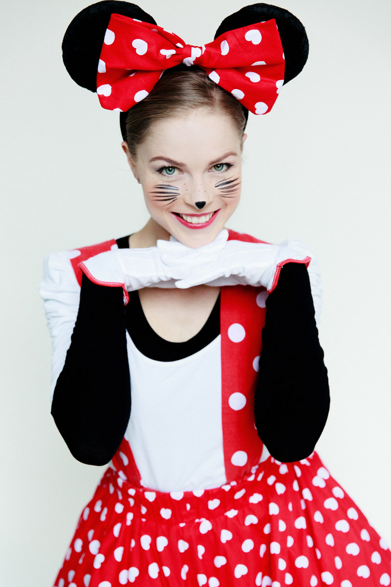
  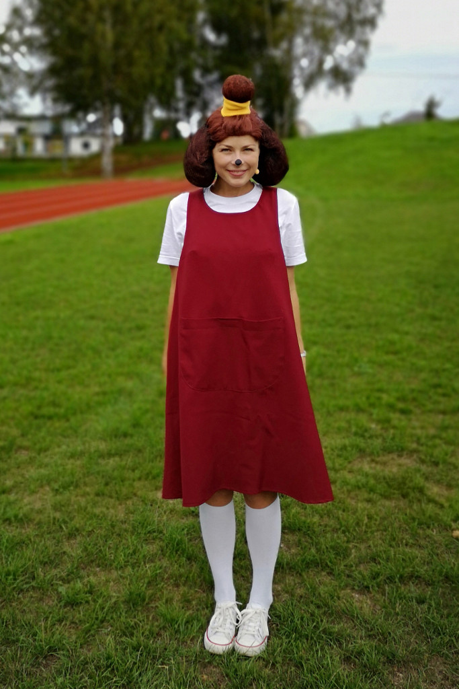
  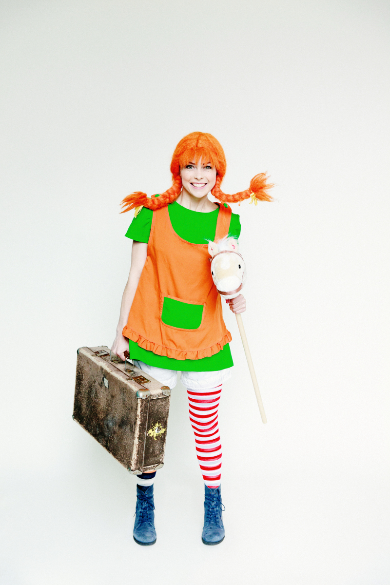

**MAGICIAN - 115 € / 30min**
: Richard Samarüütel 
Magician Richard adds magic and mind-blowing tricks to children's birthday parties.

Richard does classic tricks with rings, tops and balls, but also more modern tricks. The performance is also interesting to watch for adults. Suitable for children aged 5-7.

  
  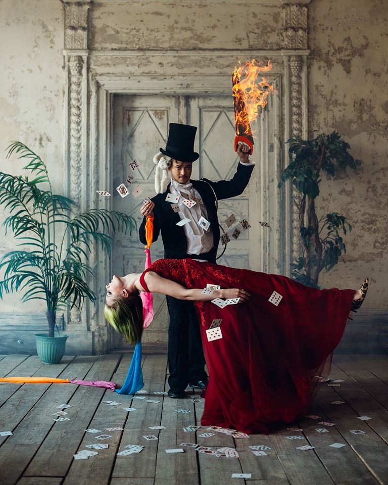

**SCIENCE THEATERSHOW**
132 € / 45min
Science Show is a 45-minute program designed to be viewed by up to 30 people and is perfect for children's birthday parties.
The show is suitable for age of 4+. Experiments are adapted to the age of children. During the science show performers perform simple but fun science experiments explaining what is going on in the experiment. Children's questions get answered, and brave ones can put their hands on a couple of experiments. The experiments should be comprehensible and interesting for the children and should be done in-house so that the children can develop an interest in science and re=do them at home. 

**SCIENCE WORK-SHOP**
132€ / 45min

Kids have 45 minutes to solve a fun science task or make a cool science toy for themselves. Each assignment is assisted by performers who provide children with all the necessary tools and guidance. The tasks are solved by known laws of physics, which are paid attention to and whose effects can be seen in real life. The science workshop is educational and full of work and suitable for children who do not want to sit back and want to do something with their hands. The research workshop is suitable for children from the age of 5+ and up to 20 children.

**SCIENCE SHOW**
270 € / 30min

The Three Piglets Science Show is a truly spectacular and memorable experience. Multicolored flames, lightning and bang, and a fairy-tale floor burst into flames. A little humor will surely enrich all the magic of science, and a fun half hour will be fun and exciting for all big and small science lovers. Suitable for ages 7+.uU

**BUBBLE SHOW**
80 € / 30min

The bubble show includes tricks with soap bubbles (different sizes bubbles, bubble trampoline, bubble aquarium, etc.).
"Man in a soap bubble" - All children are entangled in a bubble.

Big soap bubbles 20-30min + balloon design 30-60min.

All children will receive a balloon as a gift (1-4 balloons: animals, flowers, swords, hats, etc.).

Bubble show (does not include balloons) 30min / 80 €

Bubble show + balloons 1-20 children 1h / 100 €

Bubble show + balloons 21-35 children 1-1.5h / 115 €

Bubble show + balloons PREMIUM * 1-1.5h / 125 €

* After the Bubble Master's performance, kids can blow big bubbles for themselves.

**DECORATIVE HELIUM BALLOONS**
More information soon!

**CAKE TOPPERS AND NAME BANNERS**
1,5€ letter / 6€ topper

Anneli Nahk makes glitter cake toppers with name and “Happy Birthday” banners, that makes the birthday cake for her child extra-special.

CAKE TOPPER - 6 €
Price includes name and number. You can choose between different colors. The topper is white on the backside. 

BANNER - 1,5 € per letter

Happy Birthday banner makes birthday a festive occasion. The banner is made in the colors of your choice. The letters can be selected with a mat, a slight glow or a mirror effect. You can choose what to write on the banner! 

**REUSABLE TABLEWARE - FREE**
If you care about nature and want to save on disposable tableware, we offer bamboo plates and beverage cups, wheat-straw small cake plates and plastic cutlery. There are 28 sets.
The dishes must be washed yourself. If you would like us to do washing, then the fee is 10 €.

