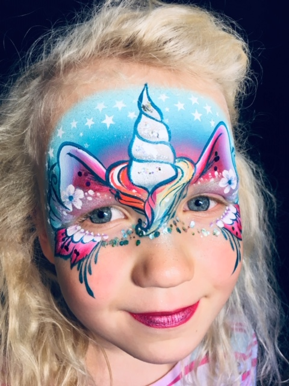
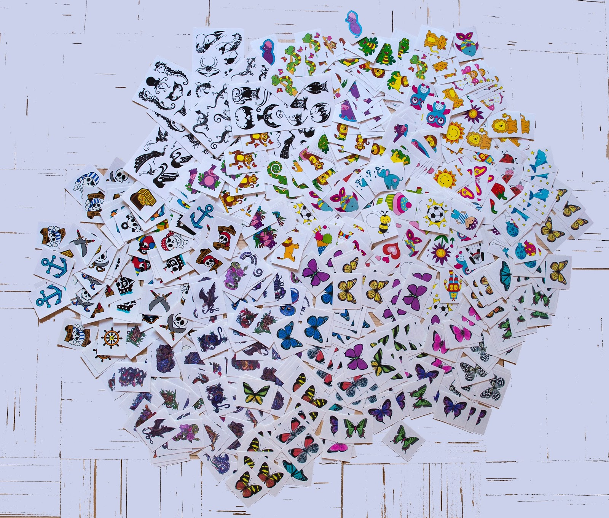
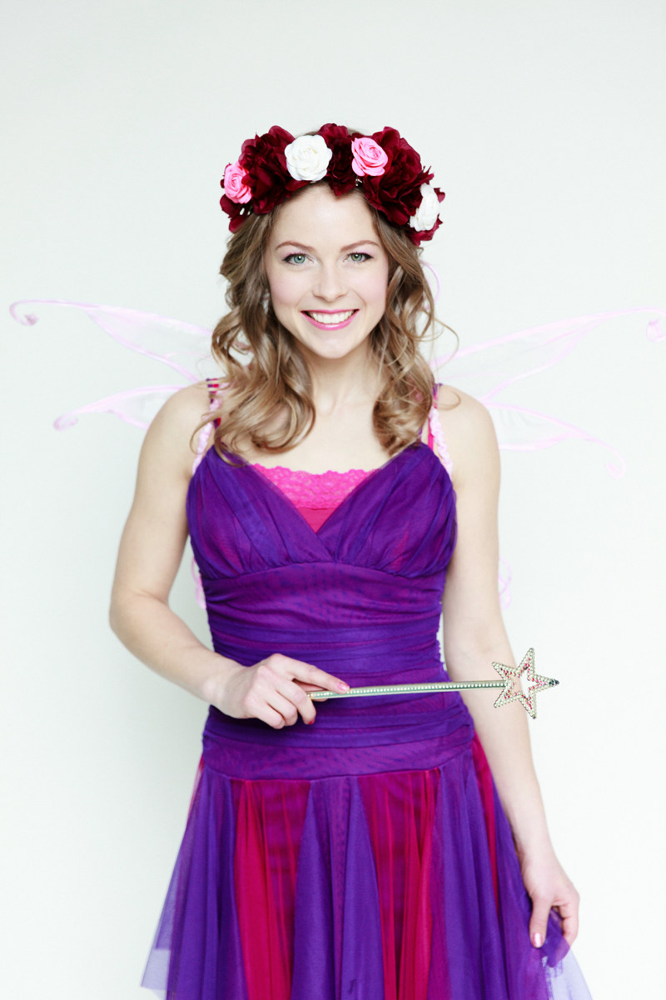
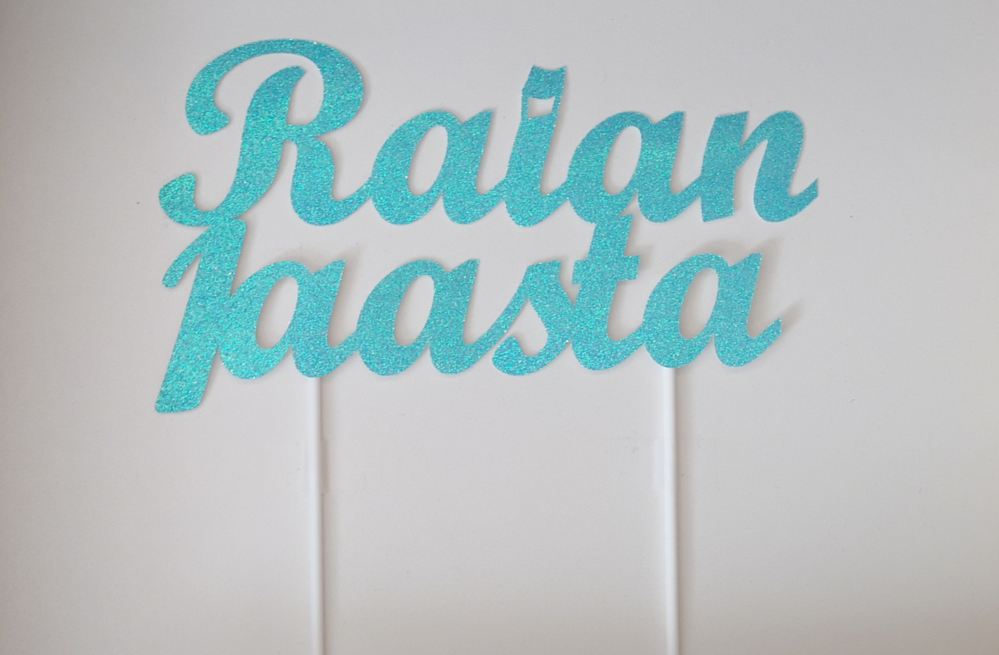
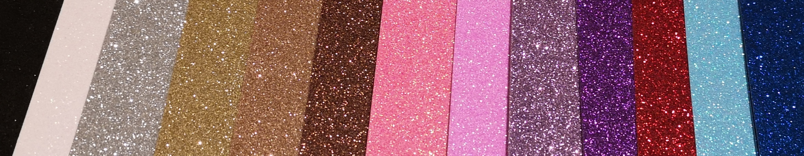
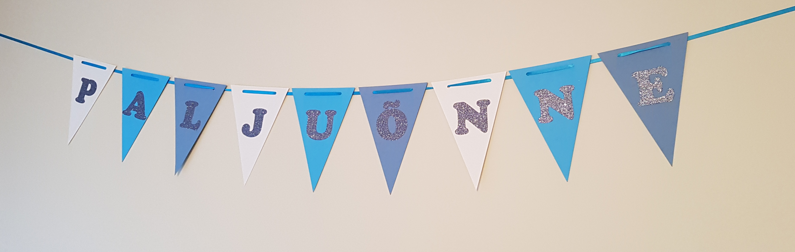
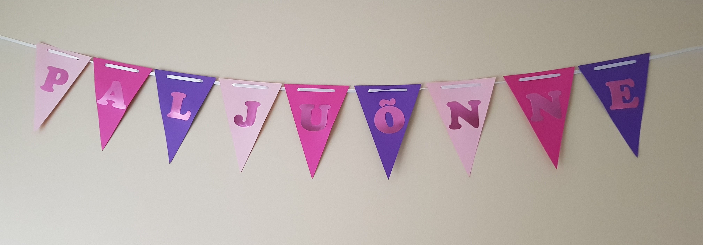

PEOJÄRGNE KORISTAMINE - 25€
: Kui sünnipäev läbi, siis lilled kaenlasse ja kingid näppu ning meie koristame ja peseme kõik ise. 

NÄOMAALINGUD - 45€/1h

: Näomaalinguid teeb Grimmikooli õppejõud ja rahvusvahelise näomaaligute konkursi võitja Ursula Otsing. 

  Ühes tunnis jõuab näomaalija teha umbes:

  1. hästi lihtsaid ja väikseid -15 nägu tunnis
  2. keskmisi 8-10 nägu tunnis
  3. suuri ja keerukamaid 5-7 nägu tunnis

  Glittertätoveeringud on lisaks 45€ tunnis ja kuni 12 last.
  
   
   
  

ÕHUPALLILOOMAD - 70€/1h

: Meelika Mäeorg teeb kõige vahvamaid õhupalliloomi!

  Pikkadest õhupallidest valmivad õhupallifiguurid panevad särama iga lapse silmad. Pidudel valmivad üldjuhul ühest kuni neljast pallist koosnevad kujundid.
  Õhupallimeisterdaja suudab teha üle 300 erineva disainiga õhupallifiguuri. Laske vabalt fantaasial lennata ja pange õhupallimeistri võimed proovile!
  
   
   
   
  
  Õhupalliloomadele lisaks saab tellida ka vesitätoveeringuid, igale lapsele 1 pilt. Vesitätoveeringute hind kokku 20€.

  Vesitätoveeringud ehk vesipildid mis kantakse käele või jalale püsivad mitmeid päevi, isegi kuni üks nädal. 
  Pildi kandmine nahale võtab aega kuni 1 minut. Valida on võimalik 500 erineva pildi seast. 
  Ei karda vett ega niiskust.
  
   

KAETUD PEOLAUD "Laste lemmikud" - 80€

: Kaetud laud 14 lapsele. 
  
  Helluse jogurtid, kartulisalat, puuvilja-juurviljavaagen, juustupulgad, popcorn, näkileivad, kamapallid, kõrsikud ja morss.

JÄÄTISEMASIN - 71€
: Pehme jäätisemasin valmistab 1 tunni ja 15 minutiga 40 pehmet jäätist. Kaasa tuleb jäätis ja 40 vahvlit. Lapsed saavad endale ise jäätist serveerida. Maitsed on hetkel vanilje ja šokolaad, võimalik on teha ka teisi maitseid. 

SUHKRUVATIMASIN - 60€
: Laste sünnipäevade tõeline hitt. Suhkruvatt valmib 60 sekundiga ja selle valmistamine on väga lihtne. Suhkru kulu 1 portsioni kohta 12-18 grammi. 
  Hinnas on: suhkruvatimasin, kuppel, suhkru dosaator, 1kg suhkrut, 50 puidust pulka. Võimalik saada värvilisi erinevate maitsetega suhkruid.

FOTOGRAAF - 135€/~2h

: Lapse sünnipäeva ehedaid emotsioone aitab püüda ja jäädvustada Helen Tulp!

  Helen on lastega vaba suhtleja ja teeb pilte peo algusest kuni tordi lahtilõikamiseni. 
  Pildistab nii üldist mänguhoogu, portreesid ja soovikorral ka perepilte ning grupipilte fotoseina juures. 
  Kui vanematel on erisoove, siis arvestab nendega alati. Ühest sünnipäevapeost valmib digialbum ~200 pildiga. 
  Pildid valmivad nädalaga ja albumile ligipääs saadetakse privaatse lingina, kust on võimalik pildid alla laadida või otse sõpradega jagada.
  
  
VIDEOGRAAF - 300€/3h

: Lapse sünnipäeva säravamad ja tähtsamad hetked kvaliteetselt videopildile!

  Videograaf Marge Prints filmib pidu kuni 3h – alates külaliste saabumistest kuni tordi lõikamiseni.
  Peost valmib korralikult kokku monteeritud, helindatud, parimate hetkedega 5 minutiline video.  
  Valmis video saab sünnipäevalaps endale USB mälupulgal 4K kvaliteedis.
  
  Peokülalised saavad filmi vaadata privaatselt lingilt internetis.
  
  [www.kuulidmuuvid.ee](http://www.kuulidmuuvid.ee){:target="_blank"}
  
  
PUTUKAPROGRAMM - Mattias Turovski - 125€/45min
: Põneva ja erilise programmi raames tutvustatakse nelja erinevat looma - hiidtigu, prussakat, raagritsikat ning 
  hiidtuhatjalaga. 
  
  Esitlusel vaadatakse nende pilte, elupaiku ja tutvustatakse ökoloogiat. Lapsed saavad tutvuda loomadega  vahetult - **loomad liiguvad käest kätte**!
  
  Programm loob eeldused selgrootute loomadega iseseisvaks tutvumiseks, suhtlemiseks ja käsitlemiseks, märksõnadega austus ja   hool. 

PEOJUHT - al 150€+km

: Peojuht Merli Rosar, Merros Stuudiost aitab teha sünnipäevad kordumatuks! 
  Valikus on mitmed kostümeeritud tegelaskujud ja programmid pikkusega 1-1,5h.

  Tegelaskujud: Rapuntsel, Pipi Pikksukk, Mereröövel, Indiaanlane, Lumivalgeke, Lotte, Jänku Juss, Nõiatüdruk, Haldjas, Printsess, Frozen Anna, Frozen Elsa, Detektiiv, Minni Hiir, Professor Siiri, Ükssarvik, Päkapikk, Troll Poppy, Vaiana. 

  Täpsem info programmide kohta: [merrosstuudio.ee/programmid/](https://merrosstuudio.ee/programmid/){:target="_blank"} või merli.rosar@gmail.com.

  Kui valite mängutoa broneerimisel peojuhi, siis võtame Teiega peagi ühendust, et täpsustada kõik sellega seonduv (peojuhi saadavus, hind, soovitud tegelaskuju jms).
  
   
  
  
  
  

MUSTKUNSTNIK - 115€/30min

: Mustkunstnik Richard Samarüütel lisab laste sünnipäevadele maagiat ja unustamatuid trikke.

  Richard teeb klassikalisi trikke rõngaste, topside ja pallidega, kuid lisaks ka ka uuema ajastu trikke. 
  Etendust on huvitav vaadata ka täiskasvanutel. 
  Sobib hästi 5-7aastastele lastele.
  
   
  
  
KOOGITOPPERID JA BÄNNERID - al 6€

: Lapse sünnipäevatordi aitab eriliseks muuta Anneli Nahk, kes meisterdab nimelisi glitter-koogitoppereid ja "palju õnne" bännereid. 

  KOOGITOPPER - 6€
  
  Hind sisaldab nime ja numbrit. Pöördel on topper valge. Tellides võimalik valida erinevate värvitoonide vahel.
  
  
  
  
  

  BÄNNER - 1,5€ tähelipuke
  
  "Palju õnne" bänner muudab sünnipäeva pidulikuks. Bänner valmistatakse Teie valitud värvides. 
  Tähed saab valida, kas matid, kergelt sätendavad või peegelefektiga. 
  Võimalik juurde tellida ka lapse nime ja vanusega lipukesed.
  
  
  
  
  
  
  
