## PEOJÄRGNE KORISTAMINE - 25€ {#cleaning}
  Kui sünnipäev läbi, siis lilled kaenlasse ja kingid näppu ning meie koristame mänguruumid ise!
  
  *Korduvkasutatavate nõude kasutamisel tuleb nõud ise puhtaks pesta. Kui soovite, et meie seda teeme, siis lisandub nõudepesu eest 15€. Nõudepesu pakume vaid õhtustele pidudele (18-21).
  
   

## KORDUVKASUTATAVAD NÕUD - TASUTA {#reusableTablewareFree}
  Kui hoolid loodusest ja soovid kokku hoida ühekordsete nõude ostu pealt, siis pakume kasutamiseks bambustaldrikuid- ja joogitopse, nisuõlekõrrest koogitaldrikuid ja metallist söögiriistu. Nõusid jagub 40 inimesele. 

  **Nõud tuleb ise puhtaks pesta.** 
  
  Õhtustele pidudele (18-21) pakume lisateenusena ka nõude pesemist - 15€.

  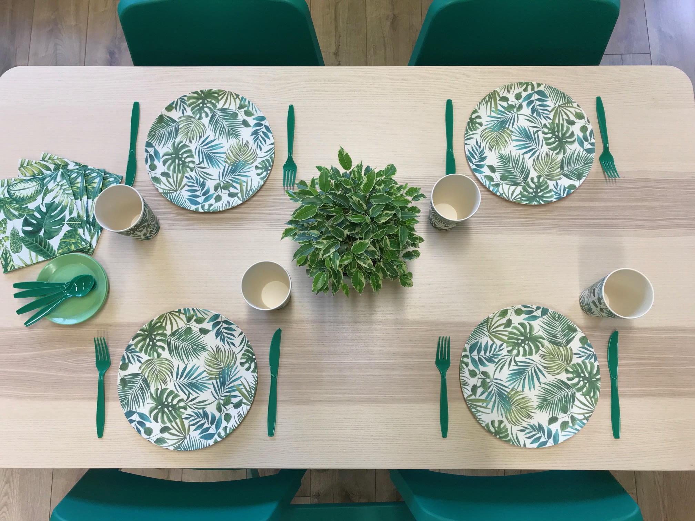
  

## NÄOMAALINGUD - 50€/1h {#facePainting}

  Näomaalinguid teeb Grimmikooli õppejõud ja rahvusvahelise näomaaligute konkursi võitja Ursula Otsing. 

  Ühes tunnis jõuab näomaalija teha umbes:

  1. hästi lihtsaid ja väikseid -15 nägu tunnis
  2. keskmisi 8-10 nägu tunnis
  3. suuri ja keerukamaid 5-7 nägu tunnis

  Glittertätoveeringud on lisaks 45€ tunnis ja kuni 12 last.
  
   
   
  

## ÕHUPALLILOOMAD - 85€/1h {#balloonAnimals}

  Meelika Mäeorg teeb kõige vahvamaid õhupalliloomi!

  Pikkadest õhupallidest valmivad õhupallifiguurid panevad särama iga lapse silmad. Pidudel valmivad üldjuhul ühest kuni neljast pallist koosnevad kujundid.
  Õhupallimeisterdaja suudab teha üle 300 erineva disainiga õhupallifiguuri. Laske vabalt fantaasial lennata ja pange õhupallimeistri võimed proovile!
  
   
   
   
  
  Õhupalliloomadele lisaks saab tellida ka vesitätoveeringuid, igale lapsele 1 pilt. Vesitätoveeringute hind kokku 20€.

  Vesitätoveeringud ehk vesipildid mis kantakse käele või jalale püsivad mitmeid päevi, isegi kuni üks nädal. 
  Pildi kandmine nahale võtab aega kuni 1 minut. Valida on võimalik 500 erineva pildi seast. 
  Ei karda vett ega niiskust.
  
   

## TOIT PEOLAUALE - al 60€ {#torelaCatering}

  Sünnipäevale tulles on peolaud hea ja paremaga kaetud! 
  
  **KOOKER MINIPANNKOOGID - al 60€**
  Vahva peolaud soolaste ja magusate minipannkookidega ning jookidega. Koogid ja lisandid on serveeritud armsates pruunides peokarpides. Karpidel on sisu kirjeldavad sildikesed. Lisaks kuuluvad komplekti tillukesed biomärgistusega lootsikud, kahvikesed ja salfad, et mõnus ja käepärane süüa oleks.

  

  Sünnipäevapakett 5-le külalisele
Pakett sisaldab:
**Soolased minipannkoogid**
-Singi-juustutäidisega minipannkoogid 50 tk
-Kana-paprikatäidisega minipannkoogid 50 tk
Kastmed: tillikaste (100ml), tšillimajonees (100ml), küüslaugukaste (100ml)
**Magusad minipannkoogid**
-Minipannkoogid 100 tk
Lisandid: vaarika toormoos (100ml), kondenspiim (100ml), Nutella (100ml), Maitsete Majaka soolakaramelli kaste (100ml),
**Joogid**
Rabarberilimps 3 pdl
Õunalimps 2 pdl

Paketi maksumus 5-le: 60€ 
Paketi maksumus 10-le: 110€ 
Paketi maksumus 15-le: 150€ 
Paketi maksumus 20-le: 190€ 
  
  
  **TASKUKOHANE PAKETT 15-LE - 119€**
  
  -Tortilla valik 1.2 kg (Singi tortilla, Tuunikala tortilla, Lumekrabiliha tortilla) 
  -Kananagitsad kastmega (750 gr) 
  -Mini viineripirukad 30 tk 
  -Lavašikrõpsud hapukoore kastmega (1 vaagen/170g) 
  -Kevadrullid kastmega 20 tk 
  -Juurviljavaagen 1 kg 
  
  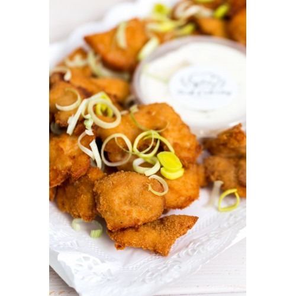 
  
  **LASTE PAKETT 15-LE - 149€**
  -Mini-burger kana šnitsliga, värske tomati-ja-hapu kurgiga 15tk
  -Tortilla valik 1.2 kg (Singi tortilla, Tuunikala tortilla, Lumekrabiliha tortilla)
  -Lavašikrõpsud hapukoore kastmega (1 vaagen/170g) 
  -Viineripirukad 30 tk
  -Kevadrullid kastmega 20 tk 
  -Juurviljavaagen 1kg 
  -Puuviljavaagen 1,5 kg
  
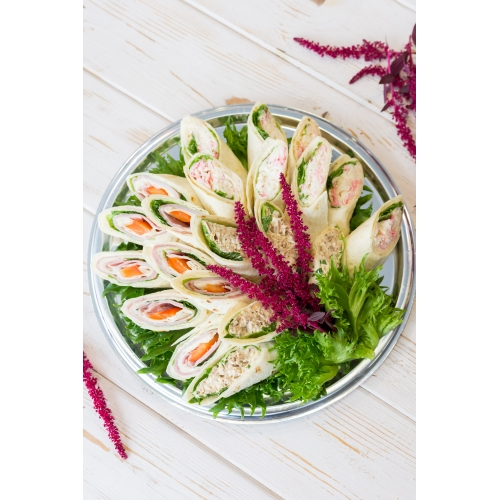 

## ÕIE LIMONAAD - 3,5L / 18€ {#õielimonaad}
[ÕIE koduleht](https://blossom.ee/){:target="_blank"}

LOODUSLIKEST KOOSTISAINETEST JOOK
Vähe suhkrut, palju head!  

  

Kihisev angervaksajook
Angervaksaõitest valmistatud karastusjook, milles on vaid väheke suhkrut ja pisut mulle. Angervaks on pärit Eesti metsaservadest, raiesmikelt, kraavipervedelt. Õied on hoolikalt korjatud, kuivatatud ja sorteeritud, et jook valmiks vaid ilusatest õitest, sest vaid nii tuleb maitse tõeliselt kirgas ja puhas. Magustamiseks kasutame heledat rafineerimata suhkrut, mis annab joogile pisut särtsakama maitse ja säilitab angervaksa helekuldse värvi.

Koostis: vesi, angervaksasiirup (vesi, angervaks, rafineerimata suhkur), sidrunhape, süsihappegaas

## RETROVAHVLID - 8€/10tk {#retroWaffels}

   Klassikalised krõbedad retrovahvlid.
  
   Koostis: 82% Eesti või, talumunad, roosuhkur, vanillisuhkur, kaneel, täispiim (3,8%- 4,2%), nisujahu ja täisteranisujahu. 
  
  **10tk - 8€**
  
  **20tk - 16€**
  
  **30tk - 24€**
  
  **40tk - 32€**
  
  **50tk - 40€**
  
  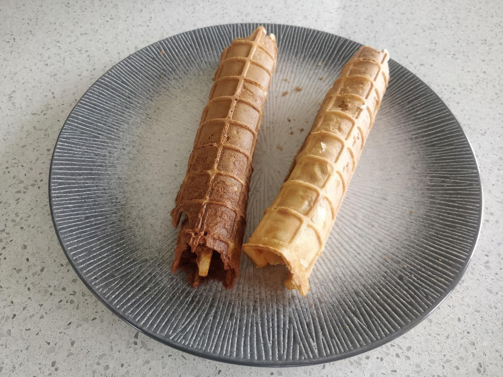
  
 
## DONUTS - al 1,5€/tk {#donuts}

   Selleks, et sünnipäev veelgi paremini veerekeks, on meil maailma parimad donutsid!  Mei donutsid valmivad käsitööna ja spetsiaalselt just teie peoks. Lisaks tavavalikus olevatele kaunistustele, võtame vastu ka eritellimusi. Laste nimedega donutsid, üksksarvikud, jalgpall, Käpapatrull, printsessi temaatika - muudame kõik donutsisoovid reaalsuseks! NB! Erisoovidele ei kehti tavahind! Tordi asemel saab sünnipäeva lõpuks pakkuda donutsi-torni! 
    
  **1tk - 2€**
  
  **4tk - 7€**
  
  **6tk - 10€**
  
  **8tk - 13€**
  
  **10tk - 15€**
  
  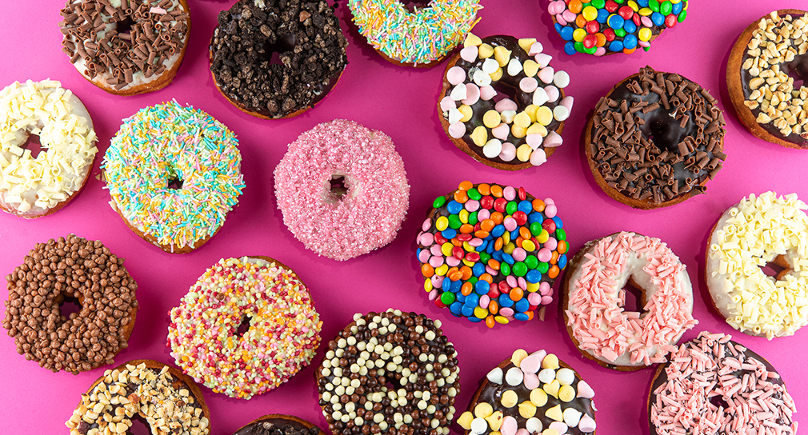
  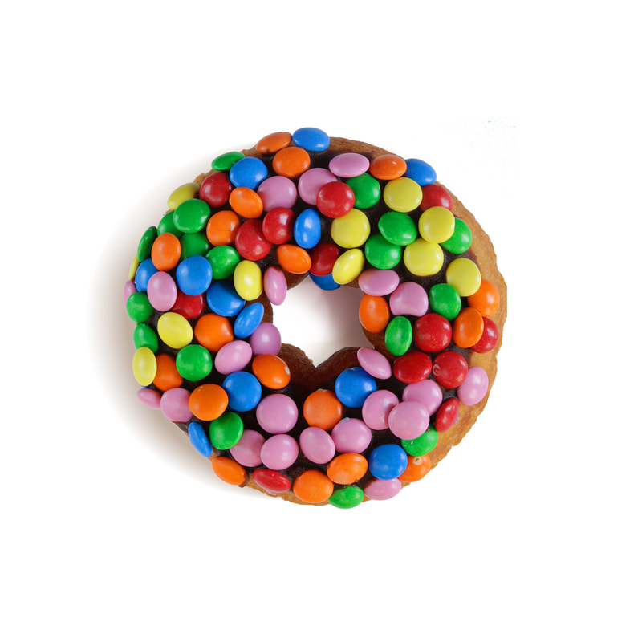
  

## PEOBOX - al 49€ {#peobox}
  Peobox on renditav peokomplekt, mille abil saad katta laua ja dekoreerida temaatiliselt peokoha. 
  
  MUGAV. KIIRE. KESKKONNASÄÄSTLIK.
  [Täpsemad hinnad ja pakettide tutvustamised](https://peobox.ee/sunnipaevad/){:target="_blank"}
  

  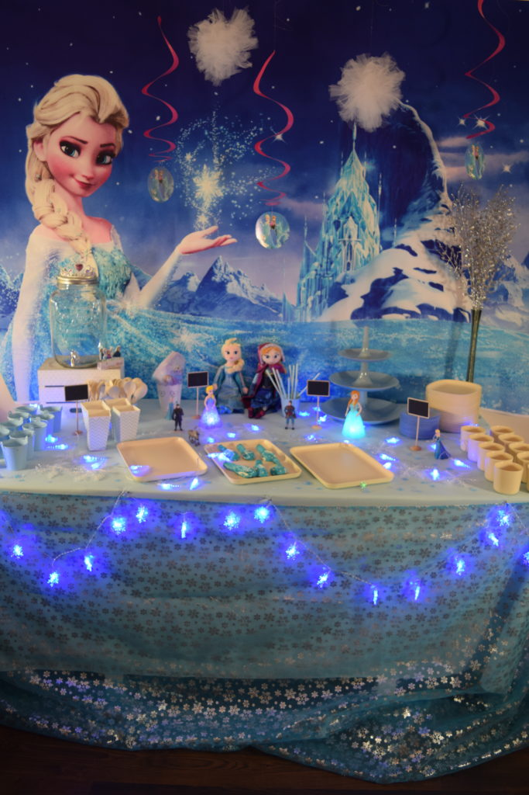 
  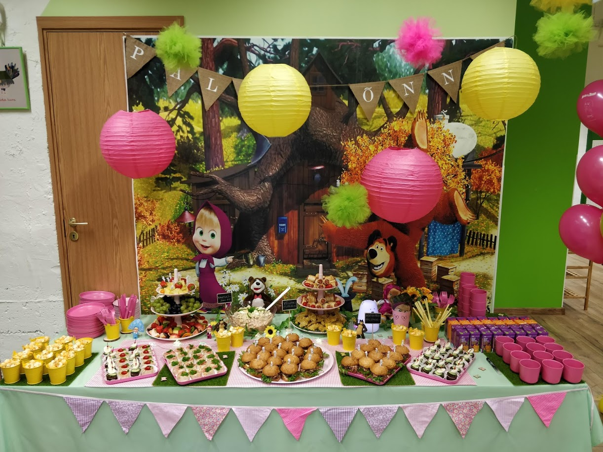
  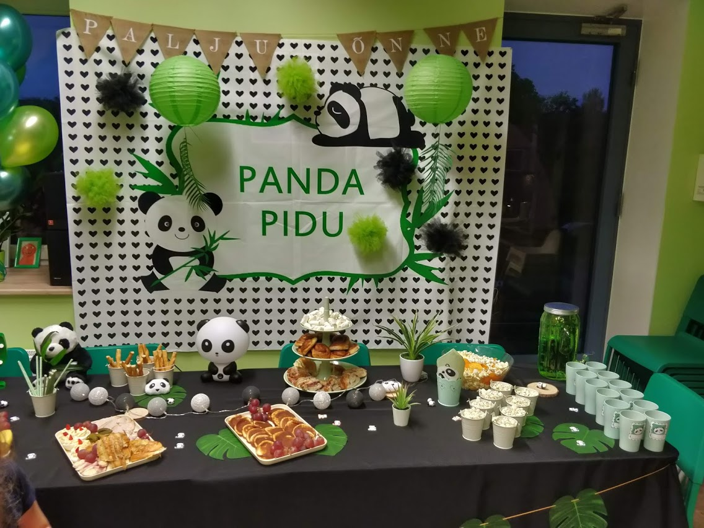
  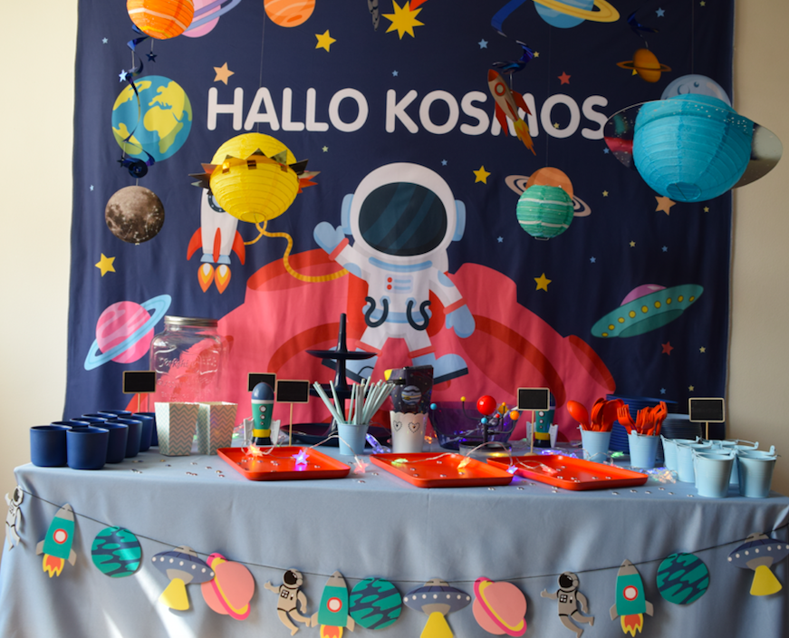 

## JÄÄTISEMASIN - 59€ {#icecreamMachine}
  Pehme jäätisemasin valmistab 1 tunni ja 15 minutiga 40 pehmet jäätist. Kaasa tuleb jäätis ja 40 vahvlit (või pooled vahvlid, pooled topsid). Lapsed saavad endale ise jäätist serveerida. Maitsed on hetkel vanilje ja šokolaad, võimalik on teha ka teisi maitseid. 
  
  Ühe jäätisemasina rent - 59€		
  Kahe jäätisemasina rent (kaks maitset) - 89€		
  
  Ühe jäätisemasina rent kõrghooajal (mai, juuni, juuli)- 69€		
  Kahe jäätisemasina rent kõrghooajal (kaks maitset) - 109€		
		

   
 
 
  **JÄÄTISE LISANDID + 9€**
  Jäätise kaunistuste komplekt: vahukommid, nonparellid, piimašokolaadi puiste ja tumedad krõbedad kakaoküpsise tükid. 
  Kaunistused on 180ml kaanega topsis. 

   

## POPCORNIMASIN - 69€ {#popcornMachine}
  Kui lapsed muud sünnipäevapeol ei söö, siis popcorni söövad kindlasti!! Rendi peoks lahe popcornimasin, nii on lastel võimalus maitsva näksi valmimist ise vaadata! 
  Popkorni masina rent + 1 kg popkorni maisi+ 10 popkorni topsi. 1kg popkorni maisist valmib ca 30 topsi popkorni

Lisapopkorn 500 gr 2,50€
Lisatopsid 10tk 4,00€

  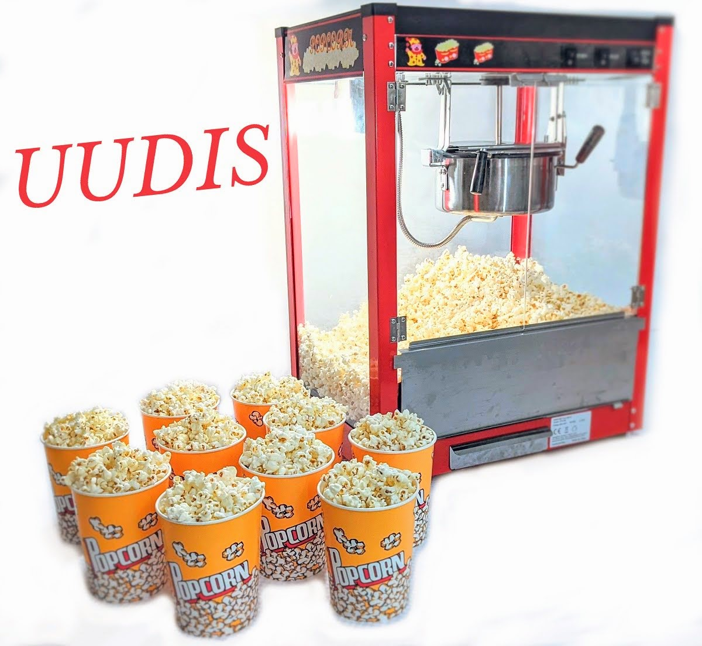 

## JÄÄTISE- JA POPCORNIMASIN - 109€ {#icecreampopcornMachine}
  Kaks masinat korraga! Sünnipä€valaps saab pakkuda oma külalistele nii soolast kui ka magusat näksi!
  Pakett sisaldab popkornimasina renti (1kg popkorni+10 topsi) ja jäätisemasina renti (4 l vanilje jäätise segu + 40 vahvlit).
  1kg popkornimaisist valmib ca 30 topsi popkorni.
  
  Lisapopkorn 500 gr 2,50€.
  Lisatopsid 10tk 4,00€

  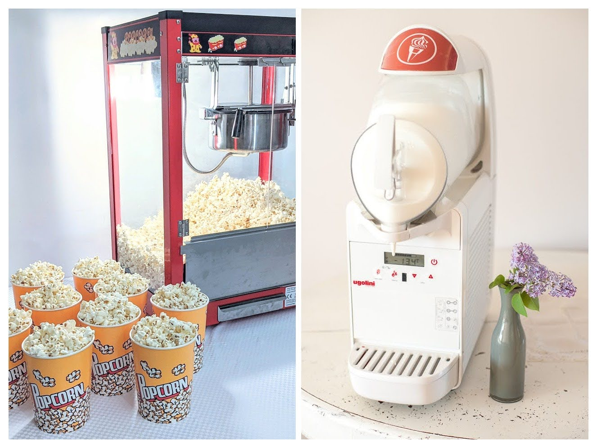 

## SUHKRUVATIMASIN - 55€ {#cottoncandy}
  Laste sünnipäevade tõeline hitt. Suhkruvatt valmib 60 sekundiga ja selle valmistamine on väga lihtne. Suhkru kulu 1 portsioni kohta 12-18 grammi. 
  Hinnas on: suhkruvatimasin, kuppel, suhkru dosaator, 1kg suhkrut, 50 puidust pulka. Võimalik saada värvilisi erinevate maitsetega suhkruid.
   
    

## FOTOGRAAF - 155€/~2h {#photographer}
  Meie fotograafiks on väga tore Helen Tulp, kes jäädvustab lapse sünnipäeva kõik ehedad emotsioonid ja parimad hetked!
  Tema portfoolioga saab tutvuda siin: [helentulp.com](https://www.helentulp.com/){:target="_blank"}

  Helen on lastega vaba suhtleja ja teeb pilte peo algusest kuni tordi lahtilõikamiseni. 
  Pildistab nii üldist mänguhoogu, portreesid ja soovikorral ka perepilte ning grupipilte fotoseina juures. 
  Kui vanematel on erisoove, siis arvestab nendega alati. Ühest sünnipäevapeost valmib digialbum ~200 pildiga. 
  Pildid valmivad nädalaga ja albumile ligipääs saadetakse privaatse lingina, kust on võimalik pildid alla laadida või otse sõpradega jagada.
  NB! Antud hind kehtib sünnipäeva pildistamisel! Eriürituste pildistamiseks küsida pakkumist!

   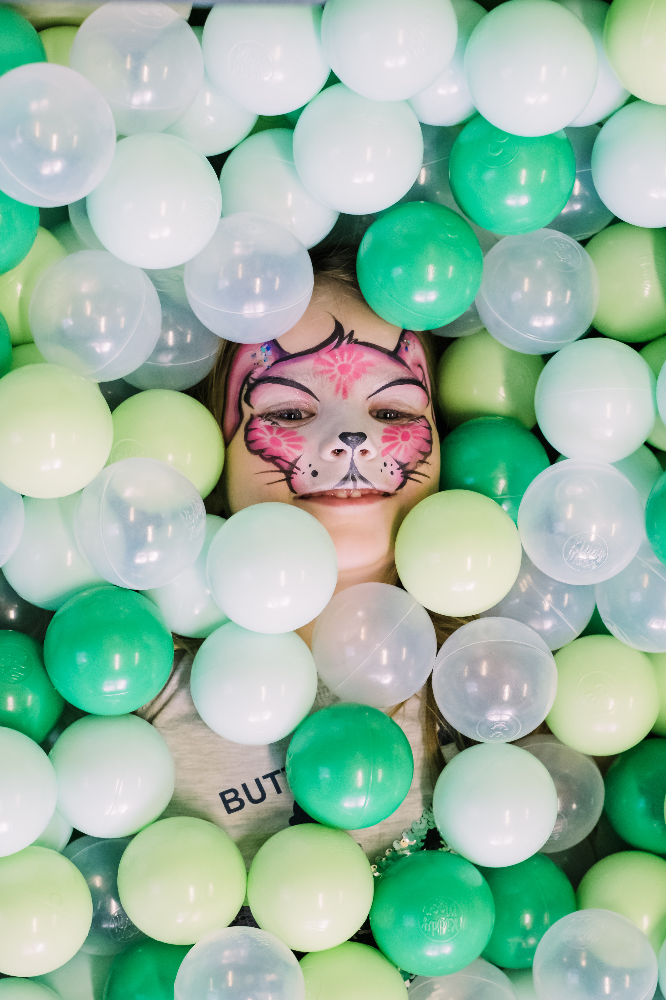 
   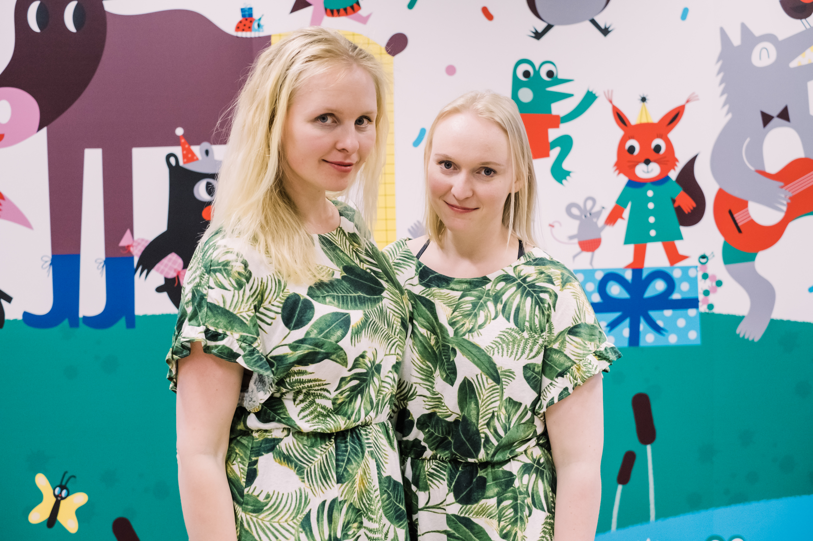 
  

## VIDEOGRAAF - 300€/3h {#videographer}

  Lapse sünnipäeva säravamad ja tähtsamad hetked kvaliteetselt videopildile!

  Videograaf Marge Prints filmib pidu kuni 3h – alates külaliste saabumistest kuni tordi lõikamiseni.
  Peost valmib korralikult kokku monteeritud, helindatud, parimate hetkedega 5 minutiline video.  
  Valmis video saab sünnipäevalaps endale USB mälupulgal 4K kvaliteedis.
  
  Peokülalised saavad filmi vaadata privaatselt lingilt internetis.
  
  [www.kuulidmuuvid.ee](http://www.kuulidmuuvid.ee){:target="_blank"}
  
  
  
  
## PUTUKAPROGRAMM - Mattias Turovski - 160€/45min {#bugsShow}

  Põneva ja erilise programmi raames tutvustatakse nelja erinevat looma - hiidtigu, prussakat, raagritsikat ning 
  hiidtuhatjalaga. 
  
  Esitlusel vaadatakse nende pilte, elupaiku ja tutvustatakse ökoloogiat. Lapsed saavad tutvuda loomadega  vahetult - **loomad liiguvad käest kätte**!
  
  Programm loob eeldused selgrootute loomadega iseseisvaks tutvumiseks, suhtlemiseks ja käsitlemiseks, märksõnadega austus ja   hool. 
  Soovitatav laste vanus on 5+. 

    
   
   
   
   

## PEOJUHT - al 150€+km {#partyAnimator}

  Merros Stuudio vahvad peojuhid aitavad teha sünnipäevad kordumatuks! 
  Merli Hirbaum ise on väikese beebiga kodune ning peojuhina ei osale. 
  Valikus on mitmed kostümeeritud tegelaskujud ja programmid pikkusega 1-1,5h.

  Tegelaskujud: Rapuntsel, Pipi Pikksukk, Mereröövel, Indiaanlane, Lumivalgeke, Lotte, Jänku Juss, Nõiatüdruk, Haldjas, Printsess, Frozen Anna, Frozen Elsa, Detektiiv, Minni Hiir, Professor Siiri, Ükssarvik, Päkapikk, Troll Poppy, Vaiana. 

  Täpsem info programmide kohta: [merrosstuudio.ee/programmid/](https://merrosstuudio.ee/programmid/){:target="_blank"} või merli.rosar@gmail.com.

  Kui valite mängutoa broneerimisel peojuhi, siis võtame Teiega peagi ühendust, et täpsustada kõik sellega seonduv (peojuhi saadavus, hind, soovitud tegelaskuju jms).
  
   
  
  
  
  

## MUSTKUNSTNIK - 115€/30min {#magician}

  Mustkunstnik Richard Samarüütel lisab laste sünnipäevadele maagiat ja unustamatuid trikke.

  Richard teeb klassikalisi trikke rõngaste, topside ja pallidega, kuid lisaks ka ka uuema ajastu trikke. 
  Etendust on huvitav vaadata ka täiskasvanutel. 
  Sobib hästi 5-7aastastele lastele.
  
  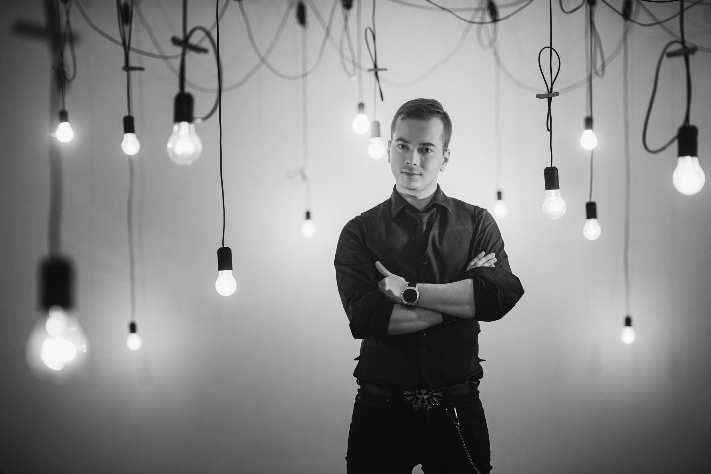
  
  
  
## TEADUSTEATER- al 110€ {#scienceTheater}

  **TEADUSTEATER - 110€/45min.**
  
  Koosneb erinevates katsetest, sealhulgas huvitavad värvimängud, teadusmaagia ja kuivjää võlud. Lapsed saavad tutvust teha nii füüsika- kui ka keemiaseadustega ja seda muidugi väga lihtsas ja lapsesõbralikus võtmes.

Kuulajate arvu maksimum puudub!
  
  **LIMA TÖÖTUBA - 12€/in€/45min**
  
Lapsed saavad meisterdada kaks erinevat lima ja neid erinevate sädeluste ja elementidega kaunistada. Lapsed saavad limad endale. Lisaks saavad lapsed kohapeal mängida poolvedela limaga.

Osalejate arv: kuni 12
Hind lapsevanemale / peo korraldajale: <6 in 15€/in ; 7-12 in 12€/in

  **KEEMIA TÖÖTUBA - 12€/in€/45min**
  
Lapsed tutvuvad labori ohutusreeglitega. Õpime tundma aluseid ja happeid ning ainete tihedusi. Lisaks saab iga laps teha oma vulkaani ja laavalambi.

Osalejate arv: kuni 12
Hind lapsevanemale / peo korraldajale: <6 in 15€/in ; 7-12 in 12€/in

  

  
## MULLISHOW - al 125€/40min {#mullimeister}

  Mullimeister (http://mullimeister.ee) toob sünnipäevale elevust! Show sisaldab trikke seebimullidega (erineva suurusega mullid, mullilohed, mullitorud, mullibatuut, mulliakvaarium jne).

  
  Mulli-show (ei sisalda õhupalle) **40min/125€**
  
  Mulli-show + õhupallid 1-1,5h	1-20 last	**1h+/150€**
    
  Mulli-show + õhupallid PREMIUM*	**1.5h/175€**

  *Pärast Mullimeistri etteastet saavad kõik lapsed ise suuri mulle puhuda.
  
  Broneerimiseks kirjutada info@mullimeister.ee.

  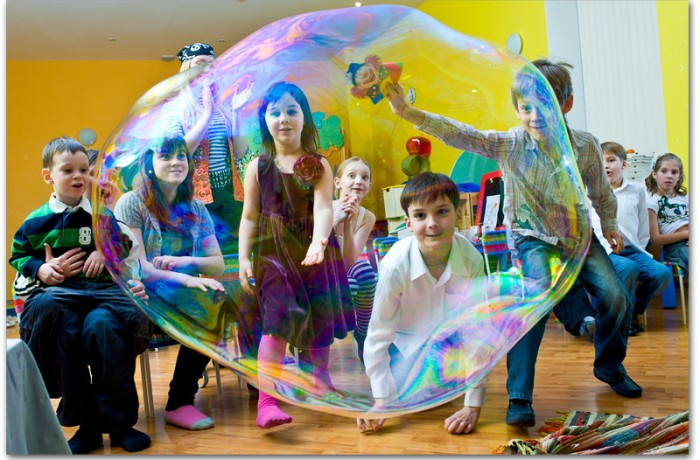
  
  
## KOOGITOPPERID JA BÄNNERID - al 6€ {#cakeTopperBanner}

  Lapse sünnipäevatordi aitab eriliseks muuta Anneli Nahk, kes meisterdab nimelisi glitter-koogitoppereid ja "palju õnne" bännereid. 

  KOOGITOPPER - 6€
  
  Hind sisaldab nime ja numbrit. Pöördel on topper valge. Tellides võimalik valida erinevate värvitoonide vahel.
  
  
  
  

  BÄNNER - 1,5€ tähelipuke
  
  "Palju õnne" bänner muudab sünnipäeva pidulikuks. Bänner valmistatakse Teie valitud värvides. 
  Tähed saab valida, kas matid, kergelt sätendavad või peegelefektiga. 
  Võimalik juurde tellida ka lapse nime ja vanusega lipukesed.
  
  
  
  
  
  
  
  
  
  
## ÕHUPALLID - al 26€ {#balloons}

  Õhupallid teevad alati laste tuju heaks! Õhupallid kaunistavad Torela peoruumi ning jäävad kodus veel pikaks ajaks pidu meenutama!
  Meil on pakkuda koostöös Peoboxiga 10 erinevat paketti!
  Õhupallide värvid saab klient ise valida.
  Numbripallide värvivalik: hõbe, kuldne, must, heleroosa, helesinine, kuldneroosa. 
  Hind sisaldab ka transporti!

 
 
  **ÕHUPALLIKOMBO 5 latekspalli + 1 fooliumpall - 26€**
    
  
  **ÕHUPALLIKOMBO 7 latekspalli + 1 fooliumpall - 30€**
  
  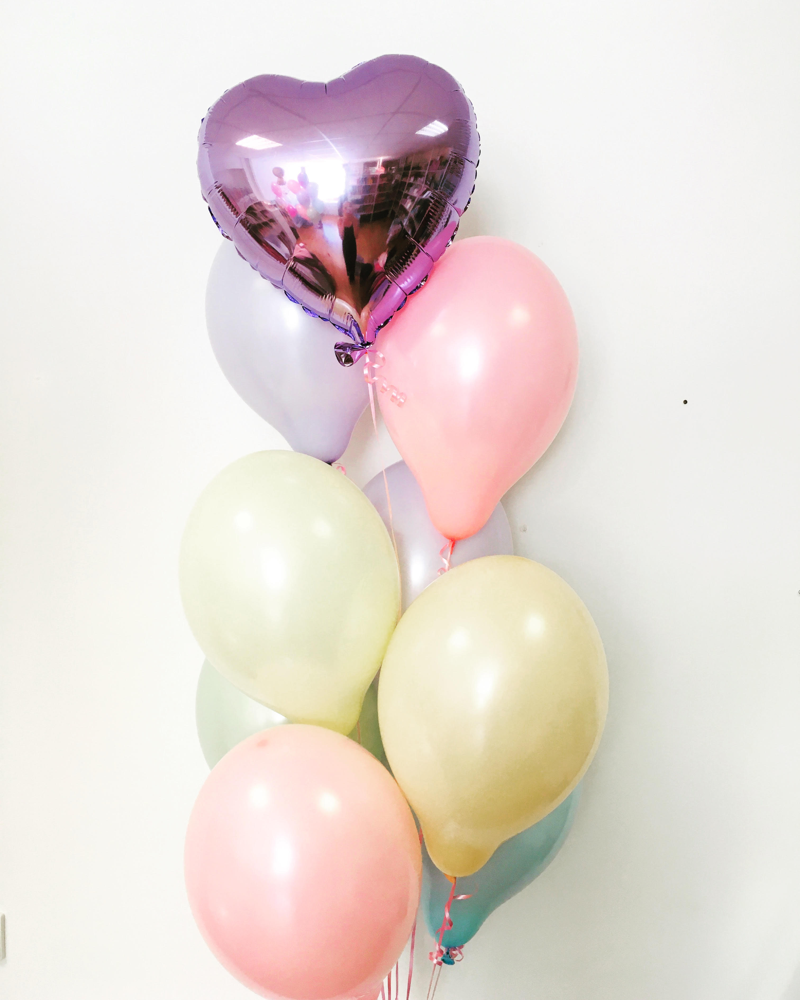
  
  
   **ÕHUPALLIKOMBO 9 latekspalli - 29€**
  
  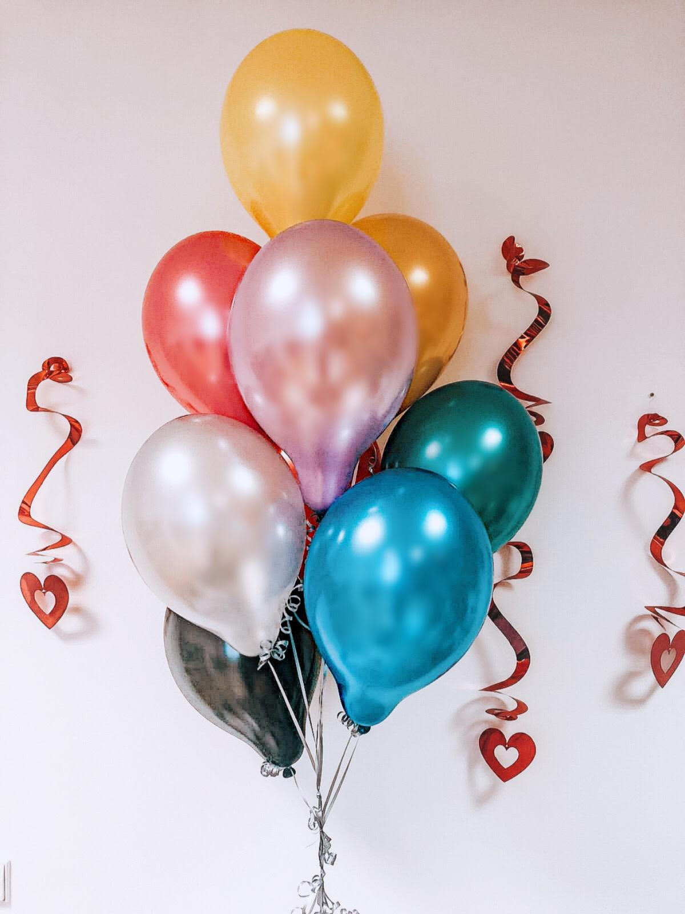
  
  
  **ÕHUPALLIKOMBO 9 latekspalli + 1 fooliumpall - 34€**
  
  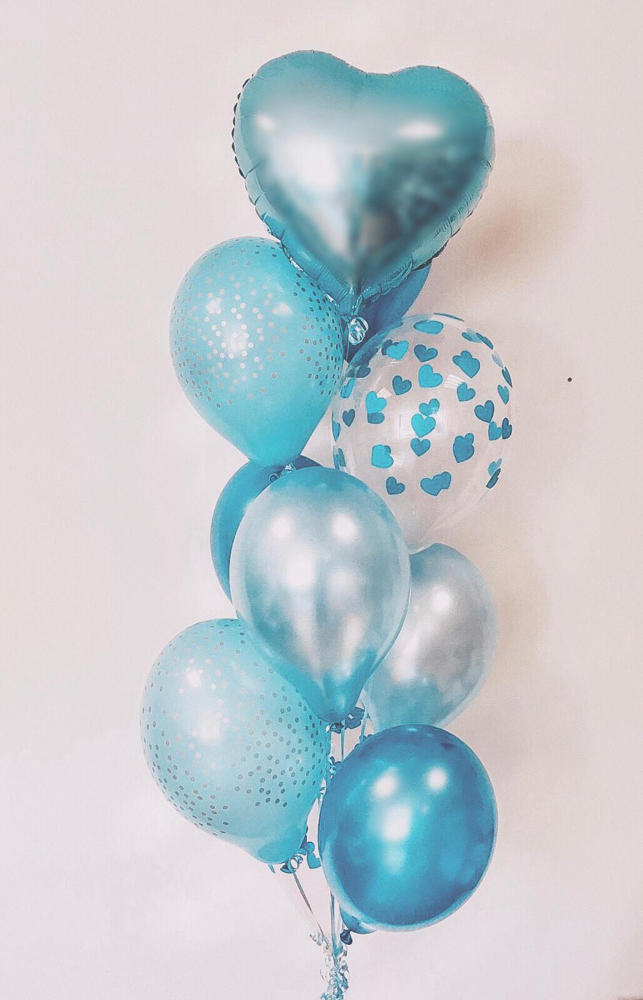
  
  
  **ÕHUPALLIKOMBO 9 latekspalli + 1 suur numbripall - 41€**
  
  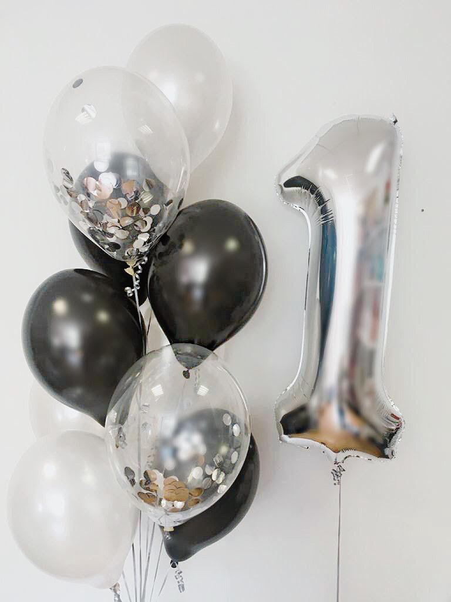
  
 
  **ÕHUPALLIKOMBO 9 latekspalli + 1 fooliumpall + 1 suurt numbripalli - 46€**
  
  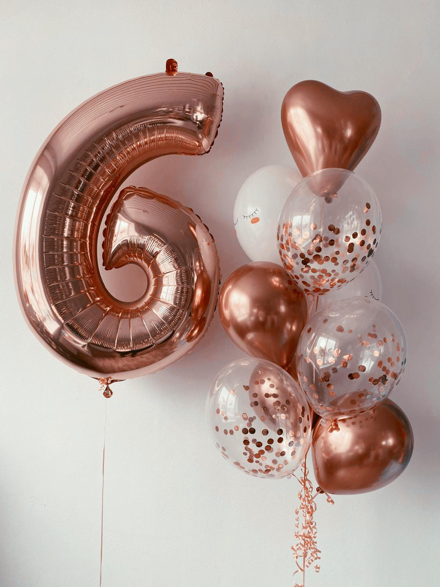
 
 
  **ÕHUPALLIKOMBO 9 latekspalli + 1 fooliumpall + 2 suurt numbripalli - 57€**
  
  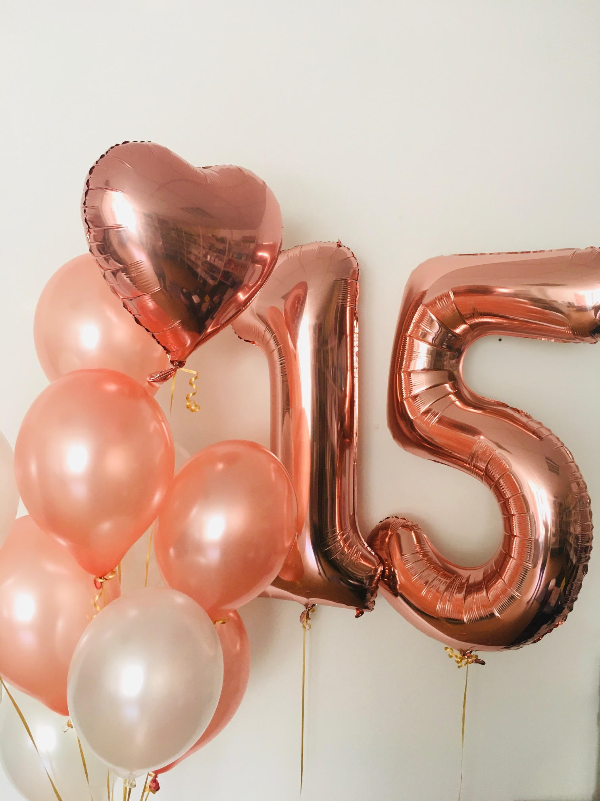
  
  
  **ÕHUPALLIKAAR 2,5M - 43€**
  
  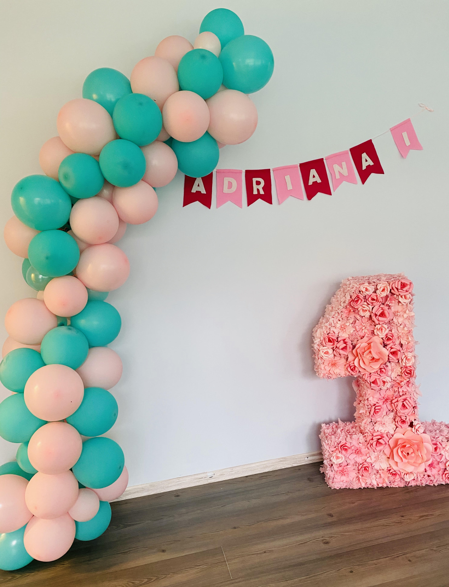
  
  
   **ÕHUPALLIKAAR 5M - 73€**
  
  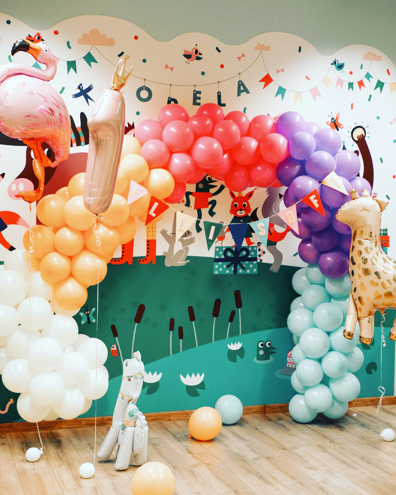
  
  
  

  
  
  
  
  
  
