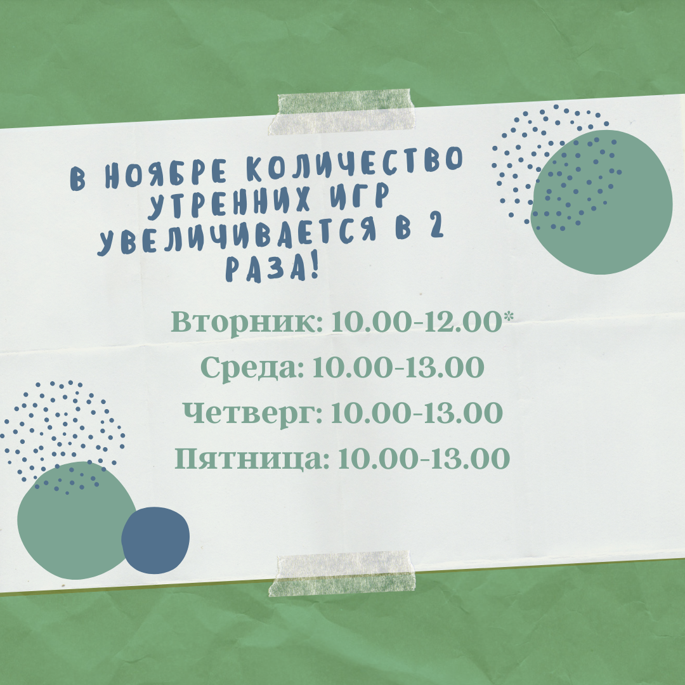

У нас происходит много тематических утренних и вечерних мероприятий, куда ждём всех, кому интересно.

Пожалуйста, сообщите нам об своем участии, 
написав на [{{ site.email | replace: '@', '$'}}](mailto) или поставив "Going" к мероприятию в [Facebook](https://www.facebook.com/pg/Torelamangutuba/events/).

Игровая комната находится на 2-м этаже, наберите 2 в домофоне.

Проще всего быть в курсе мероприятий, подключившись к нашей [Facebook странице](https://www.facebook.com/pg/Torelamangutuba/events/)!

**5-ти разовая карта посещения за 25€**

Именную дигитальную карту пришлём по электронной почте. Карта действует 3 месяца и только на мероприятиях за 7€.

# Следующие мероприятия

**02.12 - Блинное утро**
10.00-13.00
На столе разные блины и начинки.
Плата за участие 7 € (ребенок + родитель, следующий ребенок в семье +3€).

**03.12 - Утренняя игра + фотограф**
10.00-13.00
Фотограф делает красивые рождественские фотографии в нашем украшенном уголке.
Предлагаем закуски и кофе. 
Плата за участие 25 €. 

**04.12 - Утренняя игра + смузи!**
10.00-13.00
Готовим разные смузи, предлагаем закуски и кофе. 
Плата за участие 7 € (ребенок + родитель, следующий ребенок в семье +3€).

**08.12 - Утренняя игра + домашние имбирные пряники**
10.00-12.00 (2х)
Готовим домашние имбирные пряники, предлагаем закуски и кофе. 
Плата за участие 5 € (ребенок + родитель, следующий ребенок в семье +2€).

Сморите актуальный список на [эстонском языке](/syndmused/).
