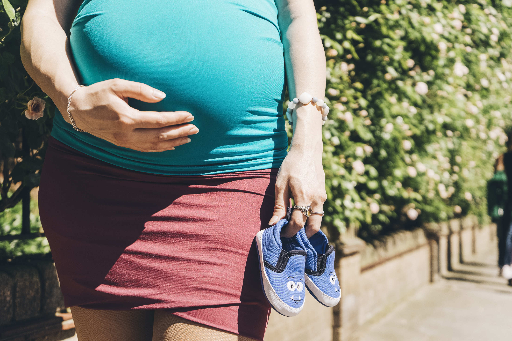

**MÄNGUHOMMIKUD JA -ÕHTUD**

**12.02.20 (18.00-19.30) - Hüpnosünnituse tutvustav tund Torela Mängutoas**
Tänapäeval pakutakse naistele üha enam loomuliku sünnituse võimalusi ja viise, et laste ilmale toomine oleks kergem ja helgem. Sünnitusele kaasatakse üha enam sünnitoetajaid ja ka era ämmaemandaid, sest naised muutuvad üha enam teadlikumaks.

Hüpnosünnitus on Marie Mongani poolt loodud meetod, mis pakub samuti loomuliku sünnituse võimalust ja seda läbi lõdvestus ja hingamistehnikate, mis aitavad luua rahulikku ja meelepärast keskkonda lapse ilmale toomiseks koos partneri või tugiisikuga.

Mida meie tutvustav tund sisaldab?

•	Mis on hüpnoos?
•	Hüpnosünnituse tutvustus ja videod.
•	Loomuliku sünnituse kasutegurite kirjeldus.
•	Millised on loomuliku sünni põhilised segavad faktorid?
•	Naise imelise keha ja meele loomulikud võimed.
•	Kergema sünni võimalikud nipid/faktid koostöös kehaga.
•	Hingamise olulisus.
•	Partneri/Tugiisiku/Sünnitoetaja rolli olulisus.
•	Taastumine peale sünnitust.
•	Kingitust
•	Kerget suupistet, teed/kohvi/vett.

Osaluspanuse 10€
Tasumine Torela Mängutoale sularahas

**13.02.20 (10.00-13.00) - MÄNGUHOMMIK**
Ootame teid kõiki mänguhommikule! Lapsed saavad omavahel mõnusalt mängida ja lapsevanemad kohvitassi taga juttu ajada! 
Laual näksimist ja kohv! 

Osalustasu: 7€ (laps+vanem, pere järgmine laps+3€) 
Kohapeal saab tasuda ainult sularahas!
Palume registreerida: tore@torela.ee või pannes Facebookis üritusele "going"!

**14.02 (10.00-13.00) - Sõbrapäeva mänguhommik + meisterdame!**
Sõbrapäeval kutsume kokku kõik suured ja väikesed sõbrad, et mõnusalt koos aega veeta!
Seekord meisterdame midagi väga vahvat! 
Laual näksimist ja kohv!

Kindlasti palume registreerida (tore@torela.ee või ürituse all "going"), kuna kohtade arv on piiratud. 

**17.02 (10.00-13.00) - PANNKOOGIHOMMIK**
Laual suured hunnikud maitsvaid pannkooke ja erinevaid moose-määrdeid. Valikus on kahed pannkoogid - vähese suhkruga "tavalised" pannkoogid ja suhkruta kaerajahu-banaanipannkoogid!
Joogiks pakume vett, piima ja kohvi!

Osalustasu 7€ (laps+vanem, pere järgmine laps +3€)
Kohapeal saab tasuda ainult sularahas!
Palume registreerida: tore@torela.ee või pannes Facebookis üritusele "going". 

**20.02.20 (10.00-13.00) - MÄNGUHOMMIK**
Ootame kõiki mänguhommikule mängima ja juttu ajama! 
Laual head-paremat ja kohv!  

Osalustasu: 7€ (laps+vanem, pere järgmine laps+3€) 
Kohapeal saab tasuda ainult sularahas!
Palume registreerida: tore@torela.ee või pannes Facebookis üritusele "going"!

**21.02 (11.00-13.00) - LOOVTEGEMISED** 
Huviring LOOVTEGEMISED
1,5-3-aastastele
REEDETI
11.00-13.00
Juhendatud tegevus on valmis seatud kell 11.00. Sõltuvalt lastest kestab tund 30-45 minutit ning siis saab Torelasse edasi mängima jääda! 
Palume registreerida: tore@torela.ee või pannes Facebookis üritusele "going"!

**25.02 (10.00-13.00) - VASTLAPÄEVA MÄNGUHOMMIK IMBI POTTERIGA**
Tähistame vastlapäeva! Räägime traditsioonidest, sööme vastlakukleid, meisterdame ning loomulikult laulame ja tantsime! Mänguhommikut aitab läbi viia meie tore sõber Imbi Potter! 
Tegevus hakkab pihta 10.15 ja kestab ~30-45 minutit!
Mänguhommikule ootame seekord pigem alla 3-aastaseid lapsi, 3+ vanustele toimub 26.02 mänguõhtu!

Loomulikult ootame ka niisama mängima, kuid siis palume tulla veidi hiljem, ~11.00-ks. 

Osalustasu: 10€ (laps+vanem, +5€ pere järgmine laps)
Kindlasti palume registreerida, kuna kohtade arv on piiratud! 
Palume registreerida: tore@torela.ee või pannes Facebookis üritusele "going" - kohtade arv on PIIRATUD!

**26.02 (18.00-20.00) - VASTLAPÄEVA MÄNGUõHTU IMBI POTTERIGA**
Tähistame vastlapäeva! Räägime traditsioonidest, sööme vastlakukleid, meisterdame ning loomulikult laulame ja tantsime! Mänguhommikut aitab läbi viia meie tore sõber Imbi Potter! 
Tegevus hakkab pihta 18.15 ja kestab ~30-45 minutit!
Mänguõhtule ootame pigem 3+ vanuseid lapsi, alla 3-aastastele on 25.02 mänguhommik. 

Loomulikult saab tulla ka niisama mängima, kuid siis palume tulla ~19.00-ks. 

Osalustasu: 10€ (laps+vanem, +5€ pere järgmine laps)
Kindlasti palume registreerida, kuna kohtade arv on piiratud! 
Palume registreerida: tore@torela.ee või pannes Facebookis üritusele "going" - kohtade arv on PIIRATUD!

**27.02 (18.30-20.30) - LÕDVESTUSÕHTU EMADELE**

Räägime iseendaks olemisest emarollis, kuidas enda jaoks luua tasakaalu ning kuidas läbi kerguse ja rõõmu olla mõnus partner ja hea ema. Räägime, kuidas emana olla hoolitsevalt laisk ning kuidas märgata oma lapse olemust väljaspool lapseks olemise piire. 

Saad kuulata ja jagada, mõtiskleda ja lihtsalt mõnusalt aega veeta.

Õhtu lõpetame maandava ja lõdvestava meditatsiooniga, et lihtsalt hea oleks olla. 

Õhtut viib läbi doula ja harmoonilise vanemluse nõustaja Ingrid Õun. 
www.facebook.com/IngridOunDoula

Osalustasu on 15€
Kindlasti palume registreerida, kuna kohtade arv on piiratud! 
Koha broneerimiseks kirjuta tore@torela.ee või ingrid.un@gmail.com või pannes Facebookis üritusele "going". 

Mängutuba asub 2.korrusel, fonolukult nr 2. 
Kohtumiseni!

**09.03.20 (10.00-13.00) - MÄNGUHOMMIK + riidest mähkmete tutvustamine**
Mähkmed.eu tutvustab riidest mähkmeid! Kõik riidest mähkmete huvilised on väga oodatud tutvuma erinevate mähkmete liikide ja tootjate toodanguga. 
Loomulikult on kõik oodatud ka niisama mängima! 
Laual head-paremat ja kohv! 

Osalustasu: 5€, alla aastase lapsega või rasedana sissepääs TASUTA! 
Kohapeal saab tasuda ainult sularahas!
Palume registreerida: tore@torela.ee või pannes Facebookis üritusele "going"!

**Märtsist PEREKOOLI vestlusringiga mänguhommikud ja -õhtud!**
Üritus toimub 6 korda - teisipäeviti 18.00-20.00 ja kolmapäeviti 11.00-13.00. 

Kutsun Sind rasedate inforingi, mis on pigem soe kohtumine kui koolitundi meenutav loeng. Tassikese sooja tee kõrvale pakun kasulikku infot ja võimalust jagada oma kogemusi teiste naistega.  Emana tean, et lapse kasvatamiseks läheb teinekord vaja tervet küla, nagu Aafrika vanasõna ütleb, mistõttu soovitan soojalt luua meie tundides uusi tutvusi. Need kohtumised sobivad nii esmarasedatele kui ka neile, kes soovivad tulla vanemate lastega. Samal ajal kui emmed teadmisi omandavad, saavad lapsed mängutoas mängida. 

Informatiivne osa kestab 45 min, kokkuvõtte loengust saadame pärast tundi osalejatele e-postiga. Lisaks jagame väikeseid kingitusi kodusteks katsetusteks.

Pileti hind 12 EUR/kord või 60 EUR/6 korda.
Grupi miinimumsuurus: 6 inimest. 

Juhendaja Daisi Kuuse: Mind on alati köitnud naiselikud teemad ja lummanud see salapärane jõud, mis pealtnäha nii õrnades kehades peitub. See on andnud mulle inspiratsiooni kirjutada artikleid ja pakkuda loenguid naistelt naistele. Hetkel omandan haridust doula ehk pere- ja sünnitoetajana, et toetada naisi nende elu kõige kaunimal  ja emotsionaalsemal ajal raseduse plaaneerimise algusest kuni tundliku sünnitusjärgse perioodi lõpuni. 

1.	Rasedusaegsete füüsiliste muutustega toimetulek. 10.03, 11.03. 

Leiame vastused järgmistele küsimustele:
Millised on peamised füüsilised muutused raseduse ajal?
Kuidas enda enesetunnet parandada, et olla särav rase?
Kuidas toitumisega konkreetseid vaevusi leevendada ja mitme eest siis ikkagi süüa?
Millised on kõige lihtsamad kodused harjutused enesetunde parandamiseks?

2.	Rasedusaegsete emotsionaalsete muutustega toimetulek. 17.03, 18.03.

Leiame vastused järgmistele küsimustele:
Millised on peamised emotsionaalsed muutused raseduse ajal?
Kuidas ema emotsionaalne seisund mõjutab veel sündimata beebit?
Kuidas oma emotsioone toitumise ja eluviiside muutmise abil tasakaalustada?
Milliste koduste harjutustega end rahuliku ja õnnelikuna hoida?

3.	Loote sünnieelne õpetamine, lootega suhtlemine. Loote areng 24.03, 25.03

Leiame vastused järgmistele küsimustele:
Millist stimulatsiooni kõhubeebi tajub?
Mida räägivad uuringud loote sünnieelse õppimise kohta?
Kuidas aidata oma kõhubeebi arengule kaasa?

4.	Vaagnapõhjalihaste treening. 31.03, 01.04.

Leiame vastused järgmistele küsimustele:
Millist rolli mängivad vaagnapõhjalihased füüsilise tervise ja sünnituse seisukohalt?
Kuidas mõjutab vaagnapõhjalihaste vorm voodielu? 
Millal on õige aeg treeninguga alustamiseks?
Kuidas vaagnapõhjalihaseid õigesti treenida, millised treeningvahendid valida?
Mida veel “alumise korruse” heaks enne sünnitust teha?

5.	Intiimsus partneriga raseduse ajal ja pärast sünnitust. 07.04, 08.04

Leiame vastused järgmistele küsimustele:
Millised muutused toimuvad peresuhete dünaamikas pärast lapsevanemaks saamist?
Kas suguelu raseduse ajal on ohutu ja milliste seisundite puhul ettevaatlik olla?
Millised on naiste ja meeste levinuimad hirmud?
Kuidas lihtsate vahenditega muuta suhet lähedasemaks?

6.	Esiklapse kohanemine uues rollis.  14.04, 15.04

Leiame vastused järgmistele küsimustele:
Mida võib tunda laps, kes on saanud suureks õeks/vennaks?
Kuidas emana jagada ressursse ja armastust, et kõik (sh sa ise), saaksid piisava osa?
Kuidas ja kellelt küsida tuge, milliseid piire kehtestada?
Mismoodi aidata lemmikloomadel muutustega kohaneda?

ÜRITUSTELE PALUME REGISTREERIDA: tore@torela.ee, teavitus chat'i või "going" üritusele. 

**PANNKOOGIHOMMIK TOIMUB IGA KUU ESIMESEL NELJAPÄEVAL JA KOLMANDAL ESMASPÄEVAL!**

**RIIDEST MÄHKMETE TUTVUSTAMINE TOIMUB IGA KUU TEISEL ESMASPÄEVAL!**

***

**VÕIMALIK SOETADA ENDALE MÄNGUHOMMIKUTE JA -ÕHTUTE 5X KAART - HIND 25€.**

Nimelise digitaalse kaardi saadame meilile. Kaart kehtib vaid 7€ maksva ürituste korral ja kehtib 3 kuud alates ostust.

Kõige paremini olete sündmustega kursis, kui liitute meie Facebooki lehe ja meililistiga!
