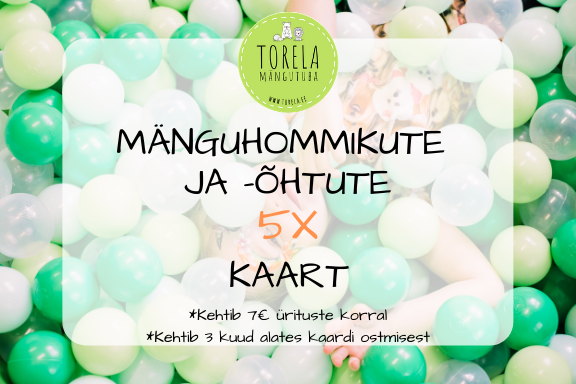

**MÄNGUHOMMIKUD JA -ÕHTUD**

**28.11 (10.00-13.00) - MÄNGUHOMMIK**
Ootame teid mänguhommikule! Laua head-paremat ja kohv!

Osalustasu 7€ (laps+vanem, pere järgmine laps +3€)
Kohapeal saab tasuda ainult sularahas!

**02.12 (10.00-13.00) - PÄKAPIKUHOMMIK**
Külla tuleb imetore Imbi Potter päkapikkudega, kellega koos laulame ja tantsime! 
Juhendatud trall hakkab 10.15 ja kestab ~30-45minutit, kui laul ja mäng läbi, siis saab mängutoas edasi mängida! 

Päkapikuhommik on suunatud väiksematele lastele, soovitatav vanus on 1-3. 
Vanusele 3+ toimuvad päkapikuõhtud 5.12 ja 11.12. 

Laual näksimist ja kohv-tee!

Osalustasu: 10€ (laps+vanem, +5€ pere järgmine laps)

Palume registreerida (tore@torela.ee või FB "going"), sest kohtade arv on piiratud! 
Kohapeal saab tasuda ainult sularahas!

**05.12 (10.00-13.00) - PANNKOOGIHOMMIK**
Ootame teid mänguhommikule! Laua palju-palju pannkooke ja erinevaid moose/määrdeid! Joogiks piim ja kohv! 

Osalustasu 7€ (laps+vanem, pere järgmine laps +3€)
Kohapeal saab tasuda ainult sularahas!

**05.12 (18.00-20.00) - PÄKAPIKUõHTU**
Külla tuleb imetore Imbi Potter päkapikkudega, kellega koos laulame ja tantsime! 
Juhendatud trall hakkab 18.15 ja kestab ~30-45minutit, kui laul ja mäng läbi, siis saab mängutoas edasi mängida! 

Päkapikuõhtu on suunatud suurematele lastele, soovitatav vanus on  3+. 
Vanusele 1-3 toimuvad päkapikuhommikud 2.12 ja 9.12. 

Osalustasu: 10€ (laps+vanem, +5€ pere järgmine laps)

Palume registreerida (tore@torela.ee või FB "going"), sest kohtade arv on piiratud! 
Kohapeal saab tasuda ainult sularahas!

**09.12 (10.00-13.00) - PÄKAPIKUHOMMIK**
Külla tuleb imetore Imbi Potter päkapikkudega, kellega koos laulame ja tantsime! 
Juhendatud trall hakkab 10.15 ja kestab ~30-45minutit, kui laul ja mäng läbi, siis saab mängutoas edasi mängida! 

Päkapikuhommik on suunatud väiksematele lastele, soovitatav vanus on 1-3. 
Vanusele 3+ toimuvad päkapikuõhtud 5.12 ja 11.12. 

Laual näksimist ja kohv-tee!

Osalustasu: 10€ (laps+vanem, +5€ pere järgmine laps)

Palume registreerida (tore@torela.ee või FB "going"), sest kohtade arv on piiratud! 
Kohapeal saab tasuda ainult sularahas!

**11.12 (18.00-20.00) - PÄKAPIKUõHTU**
Külla tuleb imetore Imbi Potter päkapikkudega, kellega koos laulame ja tantsime! 
Juhendatud trall hakkab 18.15 ja kestab ~30-45minutit, kui laul ja mäng läbi, siis saab mängutoas edasi mängida! 

Päkapikuõhtu on suunatud suurematele lastele, soovitatav vanus on  3+. 
Vanusele 1-3 toimuvad päkapikuhommikud 2.12 ja 9.12. 

Osalustasu: 10€ (laps+vanem, +5€ pere järgmine laps)

Palume registreerida (tore@torela.ee või FB "going"), sest kohtade arv on piiratud! 
Kohapeal saab tasuda ainult sularahas!

**12.12 (10.00-13.00) - MÄNGUHOMMIK**
Ootame teid mänguhommikule! Laua head-paremat ja kohv!

Osalustasu 7€ (laps+vanem, pere järgmine laps +3€)
Kohapeal saab tasuda ainult sularahas!

**16.12 (10.00-13.00) - MÄNGUHOMMIK**
Ootame teid mänguhommikule! Laua head-paremat ja kohv!

Osalustasu 7€ (laps+vanem, pere järgmine laps +3€)
Kohapeal saab tasuda ainult sularahas!

**19.12 (10.00-13.00) - MÄNGUHOMMIK**
Ootame teid mänguhommikule! Laua head-paremat ja kohv!

Osalustasu 7€ (laps+vanem, pere järgmine laps +3€)
Kohapeal saab tasuda ainult sularahas!

ÜRITUSTELE PALUME REGISTREERIDA: tore@torela.ee, teavitus chat'i või "going" üritusele. 

**PANNKOOGIHOMMIK TOIMUB IGA KUU ESIMESEL NELJAPÄEVAL!**

**RIIDEST MÄHKMETE TUTVUSTAMINE TOIMUB IGA KUU TEISEL ESMASPÄEVAL!**

***

**VÕIMALIK SOETADA ENDALE MÄNGUHOMMIKUTE JA -ÕHTUTE 5X KAART - HIND 25€.**

Nimelise digitaalse kaardi saadame meilile. Kaart kehtib vaid 7€ maksva ürituste korral ja kehtib 3 kuud alates ostust.

Kõige paremini olete sündmustega kursis, kui liitute meie Facebooki lehe ja meililistiga!
