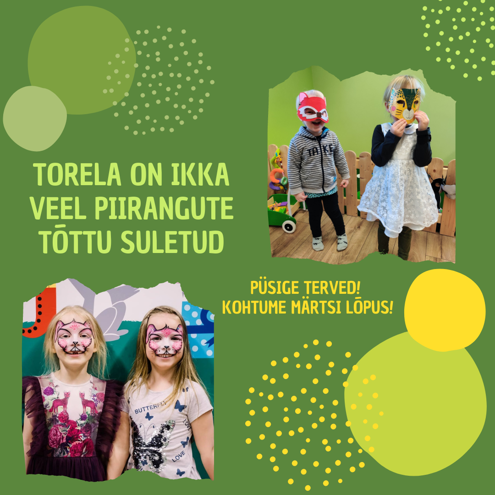
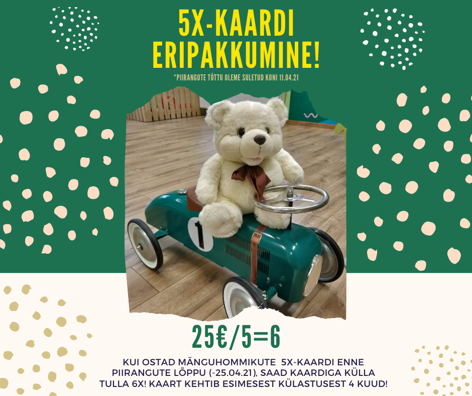

**Torela on piirangute tõttu endiselt suletud! Avame loodetavasti mai keskel-lõpus!**

Hoolimata praegusest keerulisest ajast, kui mängutoad on suletud, siis Torela aitab siiski laste sünnipäeva meeldejäävamaks teha! 💚 🙃
Torela pakub uut ja huvitavat **VIRTUAALSET-SÜNNIPÄEVAPIDU**!
Kõik "külalised" saavad enne peo algust nimelise üllatuspaki ning Torela aitab virtuaalpeo läbi viia!

### 5X KAART - HIND 25€
**Piirangute lõpuni ERIPAKKUMINE 5=6!**
Ostes 5x-kaardi enne piirangute lõppu, saad sama raha eest külastada Torelat 6 korda! Kaart hakkab kehtima esimesest külastusest ja kehtib 4 kuud! 
Nimelise digitaalse kaardi saadame meilile. 

# JÄRGMISED MÄNGUHOMMIKUD

**31.05 - 10.00-13.00**
Mänguhommik!

Tavaliste sündmuste osalustasu on 7€ (laps+vanem), pere järgmine laps +3€. Kohapeal saab tasuda ainult sularahas!

Üritustele palume registreerida: [{{ site.email | replace: '@', '$'}}](mailto), teavitus chat'i või "Going" [FB üritusele](https://www.facebook.com/pg/Torelamangutuba/events/).

Mängutuba asub 2. korrusel. Sisenemiseks valige **2** fonolukult. Kärusid saab jätta 1. korrusele.

**Pannkoogihommik** toimub 2xkuus!
 
Kõige paremini olete sündmustega kursis, kui liitute meie [Facebooki lehe](https://www.facebook.com/Torelamangutuba/events/) ja meililistiga! 

